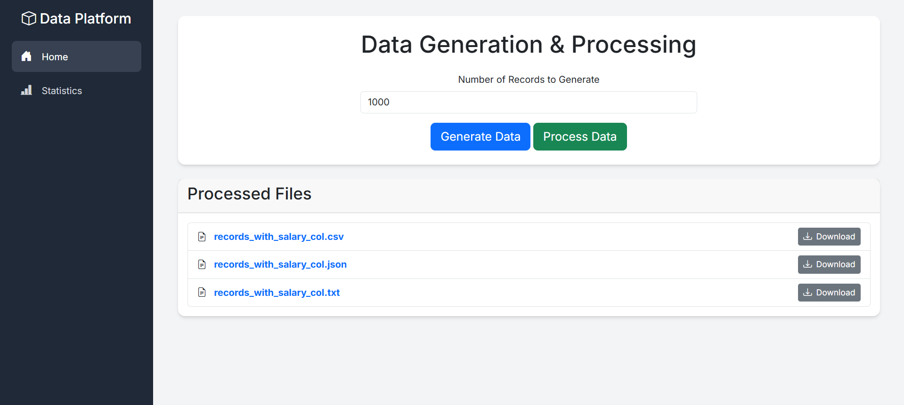

# Data Platform - Fake Data Generator & Analyzer

This is a comprehensive web-based data platform built with Flask and Pandas that allows users to generate, process, analyze, and export fake user data. It serves as an excellent portfolio project demonstrating skills in web development, data engineering, and data analysis.



---

## ✨ Features

- **📊 Interactive Dashboard**: A modern, platform-like UI with a sidebar for easy navigation.
- **⚙️ Customizable Data Generation**: Specify the exact number of records you want to generate.
- **🔍 Advanced Data Viewing**:
    - **Search**: Filter records by user name.
    - **Filter**: Filter data by city or salary category.
    - **Pagination**: Browse through large datasets with ease.
- **📈 Data Analysis & Statistics**:
    - View key metrics like total records, average salary, and average age.
    - Interactive charts (Pie & Bar) for visualizing salary distribution and top cities.
- **📥 Data Export**: Download the processed data in `CSV`, `JSON`, or `TXT` formats.

---

## 🛠️ Tech Stack

- **Backend**: Python, Flask
- **Data Manipulation**: Pandas
- **Data Generation**: Faker
- **Frontend**: HTML, Bootstrap 5, Chart.js
- **Deployment**: (Add your deployment platform here, e.g., Heroku, Vercel, AWS)

---

## 🚀 Getting Started

Follow these instructions to get a copy of the project up and running on your local machine.

### Prerequisites

- Python 3.x
- pip (Python package installer)

### Installation

1.  **Clone the repository:**
    ```bash
    git clone git clone https://github.com/elewashy/DEPI
    cd Data_Platform
    ```

2.  **Create a virtual environment (recommended):**
    ```bash
    # For Windows
    python -m venv venv
    venv\Scripts\activate

    # For macOS/Linux
    python3 -m venv venv
    source venv/bin/activate
    ```

3.  **Install the required packages:**
    ```bash
    pip install -r requirements.txt
    ```

### Running the Application

1.  **Start the Flask server:**
    ```bash
    python app.py
    ```

2.  **Open your browser** and navigate to:
    `http://127.0.0.1:5000`

---

## 📂 Project Structure

```
.
├── app.py                  # Main Flask application file
├── requirements.txt        # Project dependencies
├── README.md               # This file
├── data/                   # Raw generated data (created at runtime)
│   └── records.txt
├── processed_data/         # Processed and categorized data (created at runtime)
│   ├── records_with_salary_col.csv
│   ├── records_with_salary_col.json
│   └── records_with_salary_col.txt
└── templates/              # HTML templates
    ├── base.html           # Base template with sidebar and layout
    ├── index.html          # Home page for data generation
    ├── stats.html          # Statistics and charts dashboard
    └── view.html           # Page for viewing and filtering data
``` 