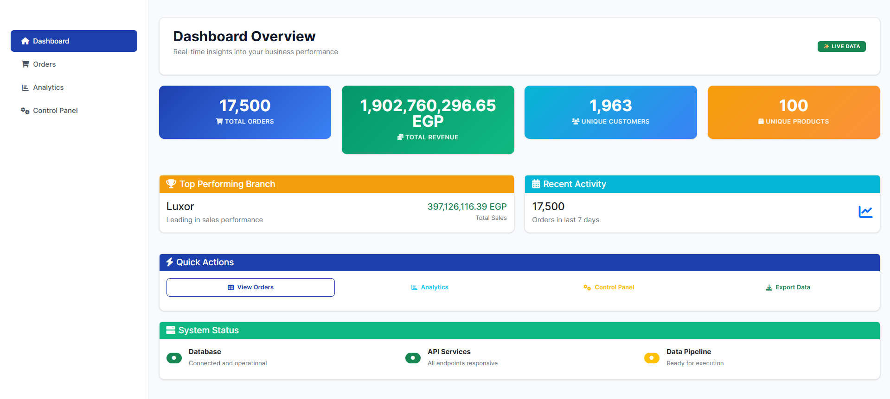
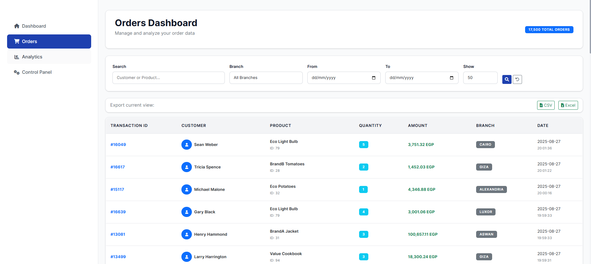
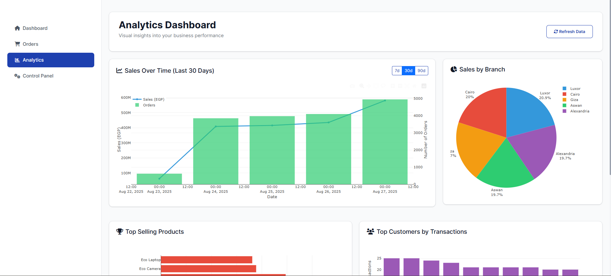
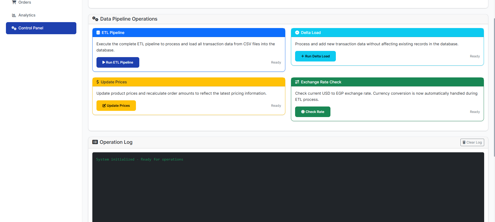

# 🏪 Market Flow Dashboard

A comprehensive **Retail Analytics & ETL Pipeline System** built with Flask, featuring real-time dashboards, automated data processing, and interactive visualizations.

**Part of my journey with Digital Egypt Pioneers Initiative - DEPI** 🚀
*Under the guidance of my instructor **Ahmed Elsaid***

---

## 📋 Table of Contents

- [Project Overview](#-project-overview)
- [✨ Key Features](#-key-features)
- [📸 Screenshots](#-screenshots)
- [🛠 Technology Stack](#-technology-stack)
- [📁 Project Structure](#-project-structure)
- [🚀 Installation & Setup](#-installation--setup)
- [⚙ Configuration](#-configuration)
- [📖 Usage Guide](#-usage-guide)
- [🔄 Data Flow](#-data-flow)
- [🗄 Database Schema](#-database-schema)
- [🔌 API Endpoints](#-api-endpoints)
- [🤝 Contributing](#-contributing)
- [📜 License](#-license)
- [📧 Contact](#-contact)

## 🎯 Project Overview

Market Flow is a sophisticated **data analytics platform** designed for retail businesses to:

- **Process and analyze** large volumes of transaction data
- **Generate comprehensive dashboards** with real-time insights
- **Execute automated ETL pipelines** for data transformation
- **Provide interactive visualizations** for business intelligence
- **Manage currency conversions** and price updates
- **Export data** in multiple formats for external analysis

## ✨ Key Features

### 📊 Analytics Dashboard
- **Real-time metrics**: Total orders, revenue, customers, products
- **Interactive charts**: Sales trends, top products, customer analysis
- **Branch-wise performance** tracking
- **Date-range filtering** for historical analysis

### 🔄 ETL Pipeline Operations
- **Automated data extraction** from multiple CSV files
- **Data transformation** with currency conversion
- **Incremental loading** (Delta Load) for new data
- **Price update management** with automatic recalculation
- **Duplicate detection** and data validation

### 🌐 Web Interface
- **Modern responsive design** with Bootstrap 5
- **Interactive data tables** with pagination and search
- **Real-time status updates** for pipeline operations
- **Export functionality** (CSV/Excel formats)

### 📈 Data Visualization
- **Sales over time** analysis with Plotly
- **Top products** performance charts
- **Branch-wise sales** distribution
- **Customer spending** patterns

### 🔌 REST API
- **Comprehensive API endpoints** for all data operations
- **Filtering and pagination** support
- **JSON responses** for easy integration
- **Error handling** with detailed messages

## 📸 Screenshots

<table>
  <tr>
    <td align="center"><strong>Home Page / Dashboard</strong></td>
    <td align="center"><strong>Orders Page</strong></td>
  </tr>
  <tr>
    <td></td>
    <td></td>
  </tr>
  <tr>
    <td align="center"><strong>Visualizations Page</strong></td>
    <td align="center"><strong>Control Panel</strong></td>
  </tr>
  <tr>
    <td></td>
    <td></td>
  </tr>
</table>

## 🛠 Technology Stack

### Backend
- **Python 3.8+**
- **Flask** - Web framework
- **SQLite** - Database
- **Pandas** - Data processing
- **Plotly** - Data visualization

### Frontend
- **HTML5/CSS3**
- **Bootstrap 5** - UI framework
- **JavaScript (ES6+)**
- **Chart.js** - Charts and graphs
- **Plotly.js** - Interactive visualizations
- **Font Awesome** - Icons

### Data Processing
- **ETL Pipeline** - Custom data processing
- **Currency API** integration via [ExchangeRate-API](https://www.exchangerate-api.com/)
- **Data validation** and cleaning
- **Automated scheduling** capabilities (conceptual)

## 📁 Project Structure

```
Market_Flow/
│
├── app.py                          # Main Flask application
├── requirements.txt                # Python dependencies
│
├── templates/                      # HTML templates
│   ├── base.html                  # Base template with navigation
│   ├── home.html                  # Dashboard overview
│   ├── orders.html                # Orders management page
│   ├── visualizations.html        # Analytics and charts
│   └── control_panel.html         # Pipeline operations
│
├── static/                         # Static assets
│   ├── css/                       # Custom stylesheets
│   ├── js/                        # JavaScript files
│   └── images/                    # Image assets
│
├── data/                          # Data files
│   ├── products.json              # Product catalog
│   ├── transactions_*.csv         # Transaction data files
│
├── db/                            # Database files
│   ├── customers.db               # Customer database
│   └── orders.db                  # Orders database
│
├── etl_pipeline.py                # Main ETL pipeline
├── delta_load.py                  # Incremental data loading
├── update_prices.py               # Price management
├── currency_conversion.py         # Currency API integration
├── generate_data.py               # Sample data generation
└── ...                            # Other utility scripts
```

## 🚀 Installation & Setup

### Prerequisites
- Python 3.8 or higher
- pip package manager
- Git (optional)

### 1. Clone the Repository
```bash
git clone https://github.com/elewashy/DEPI
cd Market_Flow
```

### 2. Create Virtual Environment
```bash
python -m venv venv
source venv/bin/activate  # On Windows: venv\Scripts\activate
```

### 3. Install Dependencies
```bash
pip install -r requirements.txt
```

### 4. Set Up Environment Variables
For currency conversion to work, you need an API key.
- Create a file named `.env` in the root directory of the project.
- Add the following line to it:
  ```env
  API_KEY=YOUR_API_KEY_HERE
  ```
- You can get a free API key from [ExchangeRate-API](https://www.exchangerate-api.com/).

### 5. Generate Sample Data (Optional)
This will create the necessary product, transaction, and customer data.
```bash
python generate_data.py
```

### 6. Run ETL Pipeline
This script processes the raw data and loads it into the `orders.db` database.
```bash
python etl_pipeline.py
```
*For subsequent data additions, you can run `python delta_load.py` for faster processing.*

### 7. Start the Application
```bash
python app.py
```
Visit `http://localhost:5000` in your browser.


## ⚙ Configuration

The main configuration is done via the `.env` file for the API key.

### Currency Conversion API
The project uses the [ExchangeRate-API](https://www.exchangerate-api.com/) to fetch real-time USD to EGP exchange rates. If the API key is not provided or the service is unavailable, a fallback rate defined in `currency_conversion.py` will be used.

### Data Management Scripts
The project includes several scripts to manage and generate data for testing and demonstration purposes:
- `generate_data.py`: Creates a full set of fresh sample data.
- `generate_new_transactions.py`: Adds new transaction files without altering existing products or customers.
- `merge_transactions.py`: Combines multiple transaction CSV files into one.
- `update_prices.py`: Updates product prices and recalculates order amounts.

## 📖 Usage Guide

1.  **Dashboard Overview**: Navigate to the home page to see key metrics like total orders, revenue, unique customers, and top-performing branches.
2.  **Orders Management**: Use the Orders page to search, filter (by branch, date), and sort transaction data. You can also export the filtered data to CSV or Excel.
3.  **Analytics & Visualizations**: Explore interactive charts for sales trends, top products, branch performance, and customer spending patterns.
4.  **Pipeline Control Panel**: From the control panel, you can manually trigger the full ETL process, run a delta load for new data, or update product prices.

## 🔄 Data Flow

```
Raw Data Sources
       ↓
[CSV Files] → [Products JSON] → [Customer DB]
       ↓
   ETL Pipeline (etl_pipeline.py)
       ↓
Data Transformation (Currency Conversion, Validation, Cleaning)
       ↓
   Orders Database (orders.db)
       ↓
  Web Dashboard & API (app.py)
       ↓
User Interaction (Analytics, Exporting Data)
```

## 🗄 Database Schema

### Orders Table (`orders.db`)
```sql
CREATE TABLE orders (
    transaction_id INTEGER PRIMARY KEY,
    product_id INTEGER,
    quantity INTEGER,
    product_name TEXT,
    amount REAL,           -- Amount in EGP
    customer_full_name TEXT,
    transaction_date TEXT,
    branch TEXT,
    transaction_date_key INTEGER  -- YYYYMMDD format
);
```

### Customers Table (`customers.db`)
```sql
CREATE TABLE customers (
    id INTEGER PRIMARY KEY,
    first_name TEXT,
    last_name TEXT,
    address TEXT
);
```

### Products JSON Structure (`products.json`)
```json
{
    "id": 1,
    "name": "BrandA Electronics Smartphone",
    "price": 500.00,
    "currency": "USD"
}
```

## 🔌 API Endpoints

### Core Endpoints

-   **GET `/`**: Home dashboard with overview statistics.
-   **GET `/orders`**: Orders management page with filtering.
-   **GET `/visualizations`**: Analytics and visualization page.
-   **GET `/control-panel`**: Pipeline operations control panel.

### API Data Endpoints

-   **GET `/api/orders`**: Get orders data with filtering and pagination.
-   **GET `/api/orders/export`**: Export orders to CSV or Excel.

### Analytics Endpoints

-   **GET `/api/analytics/sales-over-time`**: Sales data for charts.
-   **GET `/api/analytics/top-products`**: Top selling products data.
-   **GET `/api/analytics/sales-by-branch`**: Sales distribution by branch.
-   **GET `/api/analytics/top-customers`**: Top customers by transaction count.

### Pipeline Control Endpoints

-   **POST `/api/pipeline/etl`**: Execute the complete ETL pipeline.
-   **POST `/api/pipeline/delta-load`**: Execute a delta load for new data.
-   **POST `/api/pipeline/update-prices`**: Update product prices and recalculate amounts.
-   **GET `/api/exchange-rate`**: Get the current USD to EGP exchange rate.

## 🤝 Contributing

Contributions are welcome! If you have suggestions for improvements, please follow these steps:

1.  **Fork the repository**.
2.  **Create a new branch**: `git checkout -b feature/YourFeatureName`
3.  **Make your changes** and commit them: `git commit -m 'Add some feature'`
4.  **Push to the branch**: `git push origin feature/YourFeatureName`
5.  **Open a Pull Request**.

Please make sure to update tests as appropriate.

## 📜 License

This project is licensed under the MIT License - see the [LICENSE.md](LICENSE.md) file for details (if applicable).

## 📧 Contact

**Built with ❤️ by Mohamed Tamer**

*For questions or collaboration opportunities, feel free to connect!*
- LinkedIn: [Your LinkedIn Profile](https://www.linkedin.com/in/elewashy/)
- GitHub: [elewashy](https://github.com/elewashy)
