<div align="center">

# 🏙️ Smart City Data Engineering Graduation Project

## Complete End-to-End Project Documentation

[](.)
[](.)
[](.)

**A comprehensive data engineering solution demonstrating batch ETL, real-time streaming, data warehousing, and machine learning for Smart City IoT data processing**

---

[Problem Statement](#-the-problem) • [Solution Architecture](#-solution-architecture) • [Technical Implementation](#-technical-implementation) • [Business Value](#-business-value)

</div>

---

## 📑 Table of Contents

1. [Executive Summary](#-executive-summary)
2. [The Problem](#-the-problem)
3. [The Solution](#-the-solution)
4. [Project Timeline & Milestones](#-project-timeline--milestones)
5. [Solution Architecture](#-solution-architecture)
6. [Data Model Design](#-data-model-design)
7. [Milestone 1: Batch ETL Data Warehouse](#-milestone-1-batch-etl-data-warehouse)
8. [Milestone 2A: Real-Time Streaming Pipeline](#-milestone-2a-real-time-streaming-pipeline)
9. [Milestone 2B: ETL with Big Data Technologies](#-milestone-2b-etl-with-big-data-technologies)
10. [Machine Learning Integration](#-machine-learning-integration)
11. [Business Use Cases](#-business-use-cases)
12. [Performance Metrics](#-performance-metrics)
13. [Technology Stack Summary](#-technology-stack-summary)
14. [Project Structure](#-project-structure)
15. [Team & Acknowledgments](#-team--acknowledgments)
16. [Future Enhancements](#-future-enhancements)
17. [Appendix: Detailed Data Catalog](#-appendix-detailed-data-catalog)

---

## 🎯 Executive Summary

The **Smart City Data Engineering Project** is a comprehensive graduation project that demonstrates enterprise-grade data engineering skills through the construction of a complete data platform for smart city operations. The project addresses the critical need for urban centers to collect, process, and analyze data from multiple city services—including energy, transportation, emergency services, traffic management, and waste collection.

### Key Achievements

| Metric                      | Value                                       |
| --------------------------- | ------------------------------------------- |
| **Data Streams Processed**  | 5 major city services                       |
| **Total Records Managed**   | 1,051,146+ records                          |
| **Real-time Throughput**    | 125 events/second                           |
| **ML Models Deployed**      | 5 production-ready models                   |
| **Technologies Integrated** | 15+ enterprise technologies                 |
| **ETL Implementations**     | 3 distinct approaches (SQL, Python, Talend) |
| **Container Services**      | 25+ Docker containers                       |

### Project Scope


---

## 🔴 The Problem

### Urban Data Challenges

Modern cities generate massive amounts of data from various sources—IoT sensors, GPS trackers, smart meters, and emergency dispatch systems. However, this data often exists in silos, making it impossible to derive actionable insights for city operations.

#### Pain Points Identified

| Challenge                   | Impact                                 | Current State                  |
| --------------------------- | -------------------------------------- | ------------------------------ |
| **Data Silos**              | Each department operates independently | No unified data view           |
| **Manual Reporting**        | Decision-making is slow and reactive   | Hours to generate reports      |
| **No Real-time Visibility** | Emerging issues go undetected          | Post-incident analysis only    |
| **Lack of Predictions**     | Resources poorly allocated             | Reactive rather than proactive |
| **Scalability Issues**      | Systems can't handle data growth       | Performance degradation        |

#### Specific City Department Challenges

**🚌 Transportation Department**

- Cannot track bus locations in real-time
- No way to predict passenger loads or delays
- Route optimization done manually

**⚡ Energy & Utilities**

- Building consumption monitored manually
- Peak demand causes grid stress
- No predictive maintenance for devices

**🚨 Emergency Services**

- Response time optimization guesswork
- Resource allocation based on historical averages
- No pattern detection for incident prevention

**🚗 Traffic Management**

- Congestion detected only when severe
- Traffic signals operate on fixed schedules
- No predictive rerouting capabilities

**🗑️ Waste Management**

- Fixed collection schedules regardless of need
- Trucks visit half-empty containers
- Fuel and time wasted on inefficient routes

---

## ✅ The Solution

### Comprehensive Data Platform

We designed and implemented a **unified data platform** that collects data from all city services, processes it through multiple pipelines (batch and real-time), stores it in an optimized data warehouse, and provides machine learning-powered predictions.

### Solution Components

```mermaid
flowchart TB
    subgraph "Data Sources"
        E[⚡ Energy Meters]
        T[🚗 Traffic Sensors]
        B[🚌 Bus GPS]
        W[🗑️ Waste Containers]
        EM[🚨 Emergency Systems]
    end

    subgraph "Ingestion Layer"
        BATCH[Batch ETL<br/>SQL/Python/Talend]
        STREAM[Real-time Streaming<br/>Kafka + Spark]
    end

    subgraph "Storage Layer"
        BRONZE[Bronze Layer<br/>Raw Data]
        SILVER[Silver Layer<br/>Cleaned Data]
        GOLD[Gold Layer<br/>Analytics Ready]
        HDFS[HDFS<br/>Data Lake]
        HIVE[Apache Hive<br/>Warehouse]
    end

    subgraph "Analytics Layer"
        TRINO[Trino<br/>SQL Queries]
        ML[Machine Learning<br/>5 Models]
        DASH[Dashboards<br/>Visualization]
    end

    E & T & B & W & EM --> BATCH & STREAM
    BATCH --> BRONZE --> SILVER --> GOLD
    STREAM --> HDFS --> HIVE
    GOLD & HIVE --> TRINO
    GOLD & HIVE --> ML
    TRINO & ML --> DASH

    style BATCH fill:#E25A1C,color:#fff
    style STREAM fill:#231F20,color:#fff
    style GOLD fill:#FFD700,color:#000
    style ML fill:#4CAF50,color:#fff
```



### Three-Pronged Approach

| Milestone        | Focus                      | Technologies                        | Purpose                    |
| ---------------- | -------------------------- | ----------------------------------- | -------------------------- |
| **Milestone 1**  | Batch ETL & Data Warehouse | SQL Server, Python, Talend, Airflow | Traditional enterprise DWH |
| **Milestone 2A** | Real-time Streaming        | Kafka, Spark Streaming, HDFS        | IoT data processing        |
| **Milestone 2B** | Big Data Analytics         | Spark, Hive, Trino                  | Scalable analytics queries |

---

## 📅 Project Timeline & Milestones

### Development Timeline


### Milestone Deliverables

#### Milestone 1: Batch ETL Data Warehouse ✅

- Complete Galaxy Schema data warehouse
- Three ETL implementations (SQL, Python, Talend)
- Airflow orchestration for Talend jobs
- SCD Type 2 for building dimension
- Comprehensive data generation scripts

#### Milestone 2A: Real-time Streaming Pipeline ✅

- Apache Kafka with 5 topics
- Spark Streaming to HDFS
- 5 Machine Learning prediction models
- Airflow monitoring DAG
- 25+ container Docker infrastructure

#### Milestone 2B: Big Data ETL Pipeline ✅

- SQL Server to Hive ETL via Spark
- Trino SQL query engine
- 12-task Airflow DAG
- Complete containerized environment
- Production-ready rebuild scripts

---

## 🏗️ Solution Architecture

### High-Level Architecture Overview

```mermaid
graph TB
    subgraph "Data Generation"
        DS[📊 Data Generation Scripts<br/>Python-based simulators]
    end

    subgraph "Source Systems"
        CSV[CSV Files<br/>12 datasets]
        OLTP[(OLTP Database<br/>SmartCity)]
        IOT[IoT Sensors<br/>Real-time]
    end

    subgraph "ETL Layer"
        SQL_ETL[T-SQL Stored Procedures]
        PY_ETL[Python/Pandas Pipeline]
        TALEND[Talend Visual ETL]
        SPARK_ETL[Spark ETL Jobs]
        STREAM[Spark Streaming]
    end

    subgraph "Orchestration"
        AIRFLOW[Apache Airflow<br/>DAG Management]
    end

    subgraph "Storage"
        subgraph "Data Warehouse (SQL Server)"
            BR[Bronze Layer]
            SV[Silver Layer]
            GD[Gold Layer]
        end

        subgraph "Data Lake (Hadoop)"
            HDFS_RAW[HDFS Raw]
            HIVE_DWH[(Hive Tables)]
        end
    end

    subgraph "Query & Analytics"
        TRINO[Trino SQL Engine]
        JUPYTER[Jupyter Notebooks]
    end

    subgraph "Machine Learning"
        ML1[Energy Prediction]
        ML2[Traffic Prediction]
        ML3[Bus Occupancy]
        ML4[Waste Optimization]
        ML5[Emergency Response]
    end

    DS --> CSV & OLTP
    CSV --> SQL_ETL & PY_ETL & TALEND
    OLTP --> SPARK_ETL
    IOT --> STREAM

    SQL_ETL & PY_ETL & TALEND --> BR --> SV --> GD
    SPARK_ETL --> HIVE_DWH
    STREAM --> HDFS_RAW --> HIVE_DWH

    AIRFLOW -.orchestrates.-> SQL_ETL & TALEND & SPARK_ETL & STREAM

    GD & HIVE_DWH --> TRINO
    HDFS_RAW --> JUPYTER
    JUPYTER --> ML1 & ML2 & ML3 & ML4 & ML5

    style BR fill:#CD7F32,color:#fff
    style SV fill:#C0C0C0,color:#000
    style GD fill:#FFD700,color:#000
    style AIRFLOW fill:#017CEE,color:#fff
    style STREAM fill:#E25A1C,color:#fff
```



### Medallion Architecture

The project implements the **Medallion Architecture** pattern for data quality governance:

| Layer         | Purpose            | Data State                       | Tables    |
| ------------- | ------------------ | -------------------------------- | --------- |
| **🥉 Bronze** | Raw data ingestion | Unprocessed, as-is from source   | 12 tables |
| **🥈 Silver** | Data cleansing     | Cleaned, validated, deduplicated | 12 tables |
| **🥇 Gold**   | Business-ready     | Aggregated, dimensional model    | 12 tables |

### Galaxy Schema Design

The final Gold layer uses a **Galaxy Schema** (constellation schema) with shared dimensions across multiple fact tables:


---

## 📊 Data Model Design

### Dimension Tables (7 Tables)

| Table               | Purpose                              | Key Fields                                | Special Features                  |
| ------------------- | ------------------------------------ | ----------------------------------------- | --------------------------------- |
| **dim_calendar**    | Date dimension for temporal analysis | date_sk, date, year, month, day, week_day | Conformed dimension               |
| **dim_buildings**   | Building information                 | building_sk, building_id, zone_id, type   | **SCD Type 2** (history tracking) |
| **dim_devices**     | IoT device catalog                   | device_sk, device_id, device_type, status | Device metadata                   |
| **dim_zones**       | City geographic zones                | zone_sk, zone_id, zone_name               | 6 city zones                      |
| **dim_trucks**      | Waste collection vehicles            | truck_sk, truck_id, capacity_tons         | Fleet management                  |
| **dim_bus_routes**  | Public transit routes                | route_sk, route_id, distance_km           | 10 routes                         |
| **dim_event_types** | Emergency event categories           | event_type_sk, event_type_name            | 7 event types                     |

### Fact Tables (5 Tables)

| Table                       | Business Process   | Measures                           | Grain              |
| --------------------------- | ------------------ | ---------------------------------- | ------------------ |
| **fact_traffic**            | Traffic monitoring | vehicle_count, avg_speed_kmh       | Per sensor reading |
| **fact_energy_consumption** | Building energy    | kwh, voltage, current              | Per meter reading  |
| **fact_bus_gps**            | Bus tracking       | speed_kmh, occupancy_est, lat, lon | Per GPS ping       |
| **fact_emergency_calls**    | 911 dispatch       | response_time_minutes              | Per call           |
| **fact_waste_collection**   | Waste pickup       | fill_level_percent                 | Per container      |

### Record Volumes

| Category       | Table                   | Records       |
| -------------- | ----------------------- | ------------- |
| **Dimensions** | dim_buildings           | 301           |
|                | dim_zones               | 6             |
|                | dim_bus_routes          | 10            |
|                | dim_calendar            | 30            |
|                | dim_devices             | 602           |
|                | dim_event_types         | 7             |
|                | dim_trucks              | 16            |
| **Facts**      | fact_traffic            | 110,000       |
|                | fact_bus_gps            | 508,400       |
|                | fact_energy_consumption | 432,000       |
|                | fact_emergency_calls    | 780           |
| **Total**      |                         | **1,051,146** |

---

## 🔧 Milestone 1: Batch ETL Data Warehouse

### Overview

Milestone 1 demonstrates traditional data warehouse construction using multiple ETL technologies. The same data transformation logic is implemented three times to showcase different approaches:

### Technology Options


### 1. SQL-Based ETL

**Location:** `Smart_City_Milestone_1/data_with_sql/`

The T-SQL implementation uses stored procedures to move data through each layer:

```sql
-- Execution sequence
EXEC bronze.proc_load_bronze;  -- Load raw data from CSV
EXEC silver.proc_load_silver;  -- Clean and validate
EXEC gold.proc_load_gold;      -- Build dimensional model
```

**Key Features:**

- Native SQL Server BULK INSERT for high performance
- Stored procedures for maintainability
- Transaction handling for data integrity
- Built-in error logging

### 2. Python-Based ETL

**Location:** `Smart_City_Milestone_1/data_with_python/`

The Python implementation uses Pandas for data manipulation:

```python
# Pipeline execution
python main.py
```

**Key Features:**

- Flexible data transformations with Pandas
- SQLAlchemy for database connectivity
- Configurable via .env file
- Comprehensive logging

**Dependencies:**

- pandas
- sqlalchemy
- pyodbc
- python-dotenv

### 3. Talend Visual ETL

**Location:** `Smart_City_Milestone_1/data_with_talend/`

Visual ETL using Talend Open Studio with comprehensive job orchestration:

**Master Job Architecture:**


**Job Patterns:**

| Pattern              | Used For          | Components                          |
| -------------------- | ----------------- | ----------------------------------- |
| **SCD Type 2**       | dim_buildings     | tDBInput → tMap → tDBSCD            |
| **Dimension Lookup** | All fact tables   | tDBInput → tMap (joins) → tDBOutput |
| **Simple Load**      | Static dimensions | tDBInput → tMap → tDBOutput         |

### 4. Airflow Orchestration

**Location:** `Smart_City_Milestone_1/Smart_City_Airflow/`

Apache Airflow manages the automated execution of Talend jobs:


**DAG Configuration:**

- Schedule: Daily at midnight
- Retry policy: 3 attempts with 5-minute delay
- Email alerts on failure

### Data Flow Diagram


---

## ⚡ Milestone 2A: Real-Time Streaming Pipeline

### Overview

Milestone 2A implements a real-time streaming data pipeline for IoT sensor data with machine learning integration. This represents the modern approach to handling high-velocity data streams.

### Architecture



```mermaid
graph TB
    subgraph "Data Sources"
        IOT1[⚡ Energy Meters<br/>50 devices]
        IOT2[🚗 Traffic Sensors<br/>50 devices]
        IOT3[🚌 Bus GPS<br/>16 buses]
        IOT4[🗑️ Waste Containers<br/>80 units]
        IOT5[🚨 Emergency Dispatch]
    end

    subgraph "Ingestion"
        PRODUCER[Python Data Producer<br/>kafka-python]
    end

    subgraph "Message Broker"
        KAFKA[(Apache Kafka<br/>5 Topics × 3 Partitions)]
        ZK[ZooKeeper<br/>Coordination]
    end

    subgraph "Stream Processing"
        SPARK[Spark Streaming<br/>Structured Streaming API]
    end

    subgraph "Storage"
        HDFS[(HDFS<br/>3× Replication<br/>Parquet Format)]
    end

    subgraph "Machine Learning"
        ML[Spark MLlib<br/>5 Trained Models]
    end

    subgraph "Monitoring"
        AIRFLOW[Airflow DAG<br/>Health Checks]
    end

    IOT1 & IOT2 & IOT3 & IOT4 & IOT5 --> PRODUCER
    PRODUCER --> KAFKA
    ZK -.-> KAFKA
    KAFKA --> SPARK
    SPARK --> HDFS
    HDFS --> ML
    AIRFLOW -.monitors.-> KAFKA & SPARK & HDFS

    style KAFKA fill:#231F20,color:#fff
    style SPARK fill:#E25A1C,color:#fff
    style HDFS fill:#66CCFF,color:#000
    style ML fill:#4CAF50,color:#fff
    style AIRFLOW fill:#017CEE,color:#fff
```

### Kafka Topics

| Topic         | Data Type             | Update Frequency | Message Size |
| ------------- | --------------------- | ---------------- | ------------ |
| **energy**    | Smart meter readings  | 25 events/2sec   | ~150 bytes   |
| **traffic**   | Traffic sensor data   | 25 events/2sec   | ~120 bytes   |
| **bus_gps**   | Bus location tracking | 25 events/2sec   | ~160 bytes   |
| **waste**     | Container fill levels | 25 events/2sec   | ~140 bytes   |
| **emergency** | 911 call data         | 25 events/2sec   | ~180 bytes   |

### Processing Pipeline

**Step 1: Data Producer**

```bash
docker exec -d spark-master python3 /opt/scripts/data_producer.py
```

**Step 2: Spark Streaming**

```bash
docker exec spark-master spark-submit \
  --packages org.apache.spark:spark-sql-kafka-0-10_2.12:3.0.1 \
  /opt/scripts/stream_to_hdfs.py 60
```

**Step 3: ML Training**

```bash
docker exec spark-notebook spark-submit \
  --master local[*] \
  /home/jovyan/ml_energy_prediction.py
```

### Performance Characteristics

| Metric                   | Value             |
| ------------------------ | ----------------- |
| **Event Ingestion Rate** | 125 events/second |
| **End-to-End Latency**   | < 2 seconds       |
| **Kafka Throughput**     | ~20 KB/sec        |
| **HDFS Write Speed**     | ~100 KB/min       |
| **Micro-batch Interval** | 10 seconds        |

---

## 🔄 Milestone 2B: ETL with Big Data Technologies

### Overview

Milestone 2B focuses on batch ETL from SQL Server to a Hive data warehouse using Apache Spark, with Trino as the SQL query engine for analytics.

### Architecture



```mermaid
flowchart LR
    subgraph "Source"
        SQL[(SQL Server 2022<br/>SmartCityDWH<br/>12 tables)]
    end

    subgraph "Processing"
        SPARK[Apache Spark 3.3.0<br/>ETL Engine<br/>~4 min processing]
        AIRFLOW[Apache Airflow 2.7.3<br/>Workflow Orchestrator<br/>12 tasks]
    end

    subgraph "Storage"
        HDFS[(HDFS 3.3.5<br/>Distributed Storage<br/>3× Replication)]
        HIVE[(Apache Hive 2.3.2<br/>Data Warehouse<br/>12 tables)]
    end

    subgraph "Query Layer"
        TRINO[Trino 434<br/>SQL Query Engine<br/>Analytics]
    end

    SQL -->|JDBC Extract| SPARK
    SPARK -->|Transform & Load| HIVE
    HIVE -->|Parquet Format| HDFS
    HIVE -->|Query Interface| TRINO
    AIRFLOW -.orchestrates.-> SPARK

    style SQL fill:#CC2927,color:#fff
    style SPARK fill:#E25A1C,color:#fff
    style HIVE fill:#FDEE21,color:#000
    style TRINO fill:#DD00A1,color:#fff
    style AIRFLOW fill:#017CEE,color:#fff
```

### Airflow DAG: smartcity_dwh_pipeline


### Quick Start Commands

```bash
# Navigate to project
cd Smart_City_Pipeline_2_Milestone_2

# Start infrastructure
docker compose up -d

# Wait for services
sleep 120

# Trigger DAG
docker exec -u airflow data-pipeline-compose-airflow-scheduler-1 \
  airflow dags trigger smartcity_dwh_pipeline
```

### Sample Trino Query

```sql
-- Traffic analysis by zone
SELECT
  z.zone_name,
  COUNT(*) as total_readings,
  AVG(t.vehicle_count) as avg_vehicles,
  AVG(t.avg_speed_kmh) as avg_speed
FROM hive.smartcity_dwh.fact_traffic t
JOIN hive.smartcity_dwh.dim_zones z ON t.zone_id = z.zone_id
GROUP BY z.zone_name
ORDER BY total_readings DESC;
```

---

## 🤖 Machine Learning Integration

### Model Overview

The project includes 5 production-ready machine learning models for smart city predictions:

```mermaid
graph LR
    subgraph "Data Preparation"
        RAW[Raw HDFS Data] --> LOAD[Load Parquet]
        LOAD --> CLEAN[Clean & Filter]
        CLEAN --> FEATURE[Feature Engineering]
    end

    subgraph "Models"
        FEATURE --> M1[⚡ Energy Model]
        FEATURE --> M2[🚗 Traffic Model]
        FEATURE --> M3[🚌 Bus Model]
        FEATURE --> M4[🗑️ Waste Model]
        FEATURE --> M5[🚨 Emergency Model]
    end

    subgraph "Deployment"
        M1 & M2 & M3 & M4 & M5 --> SAVE[Save to HDFS]
        SAVE --> SERVE[Ready for Inference]
    end

    style M1 fill:#FF9800,color:#fff
    style M2 fill:#4CAF50,color:#fff
    style M3 fill:#2196F3,color:#fff
    style M4 fill:#9C27B0,color:#fff
    style M5 fill:#F44336,color:#fff
```



### Model Details

#### 1. ⚡ Energy Consumption Prediction

| Property        | Value                                          |
| --------------- | ---------------------------------------------- |
| **Algorithm**   | Random Forest Regressor (100 trees)            |
| **Target**      | kWh consumption                                |
| **Features**    | building_id, device_id, hour, voltage, current |
| **Performance** | R² = 0.62, RMSE = 9.75 kWh                     |
| **Use Cases**   | Peak demand prediction, anomaly detection      |

**Feature Importance:**

1. Hour (34%) - Time of day drives consumption
2. Building ID (28%) - Building type correlates with usage
3. Current (18%) - Real-time draw indicator
4. Device ID (12%) - Device-specific patterns
5. Voltage (8%) - Useful for anomaly detection

#### 2. 🚗 Traffic Congestion Prediction

| Property        | Value                                    |
| --------------- | ---------------------------------------- |
| **Algorithm**   | GBT Regressor + RF Classifier            |
| **Target**      | Vehicle count, congestion level          |
| **Features**    | zone_id, hour, day_of_week, is_rush_hour |
| **Performance** | RMSE = 12.3 vehicles, Accuracy = 0.85    |
| **Use Cases**   | Signal optimization, route planning      |

**Congestion Levels:**

- 🟢 Light: < 50 vehicles
- 🟡 Moderate: 50-100 vehicles
- 🔴 Heavy: > 100 vehicles

#### 3. 🚌 Bus Occupancy & Delay Prediction

| Property        | Value                                    |
| --------------- | ---------------------------------------- |
| **Algorithm**   | Random Forest + GBT                      |
| **Target**      | Passenger occupancy, delay estimation    |
| **Features**    | route_id, zone_id, hour, speed_kmh       |
| **Performance** | Occupancy RMSE = 8.5%, Delay R² = 0.71   |
| **Use Cases**   | Capacity planning, schedule optimization |

#### 4. 🗑️ Waste Collection Optimization

| Property        | Value                                        |
| --------------- | -------------------------------------------- |
| **Algorithm**   | Random Forest + Logistic Regression          |
| **Target**      | Fill level, collection need (binary)         |
| **Features**    | zone_id, building_id, hour, days_since_last  |
| **Performance** | Fill Level RMSE = 14%, Classification = 0.89 |
| **Use Cases**   | Route optimization, cost reduction           |

#### 5. 🚨 Emergency Response Prediction

| Property        | Value                                          |
| --------------- | ---------------------------------------------- |
| **Algorithm**   | GBT Regressor + RF Classifier                  |
| **Target**      | Response time, priority classification         |
| **Features**    | zone_id, event_type_id, hour, concurrent_calls |
| **Performance** | Response Time RMSE = 3.2 min, Priority = 0.87  |
| **Use Cases**   | Resource allocation, dispatch optimization     |

---

## 💼 Business Use Cases

### Smart City Operations Dashboard

The data platform enables the following business capabilities:

### 🚨 Public Safety

| Use Case                        | Data Source            | ML Model             | Business Impact        |
| ------------------------------- | ---------------------- | -------------------- | ---------------------- |
| Emergency Response Optimization | fact_emergency_calls   | Emergency Model      | 15-25% faster response |
| Resource Allocation             | Event patterns by zone | Priority Classifier  | Better coverage        |
| Pattern Recognition             | Historical incidents   | Time-series analysis | Predictive deployment  |

### 🚌 Transportation Management

| Use Case           | Data Source           | ML Model        | Business Impact     |
| ------------------ | --------------------- | --------------- | ------------------- |
| Route Optimization | fact_bus_gps          | Bus Model       | 20% efficiency gain |
| Capacity Planning  | Occupancy predictions | Occupancy Model | Right-sized fleet   |
| Schedule Adherence | Delay predictions     | Delay Estimator | Improved on-time %  |

### ⚡ Energy Management

| Use Case            | Data Source              | ML Model          | Business Impact        |
| ------------------- | ------------------------ | ----------------- | ---------------------- |
| Demand Forecasting  | fact_energy_consumption  | Energy Model      | Peak shaving           |
| Anomaly Detection   | Voltage/current patterns | Threshold alerts  | Preventive maintenance |
| Building Comparison | Consumption by type      | Analytics queries | Efficiency programs    |

**Sample Insight:**

- Malls: 299 kWh average consumption
- Residential: 3.25 kWh average consumption
- Commercial peak: 2-4 PM

### 🗑️ Waste Management

| Use Case              | Data Source           | ML Model              | Business Impact     |
| --------------------- | --------------------- | --------------------- | ------------------- |
| Dynamic Routing       | Container fill levels | Waste Model           | 20-30% fuel savings |
| Collection Scheduling | Fill predictions      | Collection Classifier | Optimal timing      |
| Fleet Optimization    | Truck utilization     | Analytics             | Right-sized fleet   |

### 🚗 Traffic Optimization

| Use Case             | Data Source            | ML Model               | Business Impact           |
| -------------------- | ---------------------- | ---------------------- | ------------------------- |
| Congestion Detection | fact_traffic           | Traffic Model          | Early alerts              |
| Signal Timing        | Vehicle counts by zone | Optimization algorithm | Smoother flow             |
| Road Planning        | Historical patterns    | Trend analysis         | Infrastructure investment |

---

## 📈 Performance Metrics

### System Performance

| Metric            | Milestone 1   | Milestone 2A   | Milestone 2B   |
| ----------------- | ------------- | -------------- | -------------- |
| **ETL Duration**  | ~5 min        | Real-time      | ~4-6 min       |
| **Throughput**    | Batch         | 125 events/sec | ~4,000 rec/sec |
| **Data Volume**   | 1.05M records | Continuous     | 1.05M records  |
| **Query Latency** | < 1 sec       | N/A            | < 3 sec        |
| **Startup Time**  | N/A           | ~2-3 min       | ~2-3 min       |

### Resource Requirements

| Resource    | Development | Production Recommended |
| ----------- | ----------- | ---------------------- |
| **RAM**     | 16 GB       | 32+ GB                 |
| **CPU**     | 4 cores     | 8+ cores               |
| **Storage** | 50 GB       | 500+ GB                |
| **Network** | Local       | 10 Gbps+               |

### Scalability Path


---

## 🛠️ Technology Stack Summary

### Complete Technology Matrix

| Category          | Technology     | Version     | Purpose                 |
| ----------------- | -------------- | ----------- | ----------------------- |
| **Databases**     | SQL Server     | 2022        | Source OLTP & Batch DWH |
|                   | Apache Hive    | 2.3.2       | Big Data Warehouse      |
|                   | PostgreSQL     | 13          | Airflow Metadata        |
| **Processing**    | Apache Spark   | 3.3.0       | ETL & ML Engine         |
|                   | Python         | 3.7+        | Scripting & ETL         |
|                   | Talend         | Open Studio | Visual ETL              |
| **Streaming**     | Apache Kafka   | 7.4.0       | Message Broker          |
|                   | ZooKeeper      | 7.5.0       | Coordination            |
| **Storage**       | Hadoop HDFS    | 3.3.5       | Distributed Storage     |
| **Query**         | Trino          | 434         | SQL Analytics           |
| **Orchestration** | Apache Airflow | 2.7.3       | Workflow Management     |
|                   | Celery         | Latest      | Task Queue              |
|                   | Redis          | Latest      | Message Backend         |
| **Containers**    | Docker         | 20.10+      | Virtualization          |
|                   | Docker Compose | 2.0+        | Multi-container         |
| **ML**            | Spark MLlib    | 3.3.0       | Machine Learning        |
| **Notebooks**     | Jupyter        | Latest      | Interactive Analysis    |

### Container Services (25+)

```
Airflow:        webserver, scheduler, worker, triggerer
Kafka:          broker, zookeeper, schema-registry, ksqldb
Spark:          master, worker-1, worker-2, notebook
Hadoop:         namenode, datanode-1, datanode-2, datanode-3, resourcemanager, nodemanager
Hive:           metastore, server
Trino:          coordinator
Support:        postgres, redis, sqlserver
```

---

## 📁 Project Structure

```
DEPI/
├── 📂 Smart_City_Milestone_1/          # Batch ETL Data Warehouse
│   ├── README.md                        # Milestone 1 overview
│   ├── 📂 data_with_python/            # Python ETL implementation
│   │   ├── main.py                      # Pipeline entry point
│   │   ├── requirements.txt             # Dependencies
│   │   └── *.py                         # ETL modules
│   ├── 📂 data_with_sql/               # T-SQL ETL implementation
│   │   ├── init_database.sql           # Schema creation
│   │   ├── bronze/                      # Bronze layer scripts
│   │   ├── silver/                      # Silver layer scripts
│   │   └── gold/                        # Gold layer scripts
│   ├── 📂 data_with_talend/            # Talend DDL scripts
│   ├── 📂 datasets/                     # Source data & generators
│   │   ├── generate_dimension_data.py  # Dimension generator
│   │   ├── generate_fact_data.py       # Fact generator
│   │   └── silver_data/                # Generated CSVs
│   ├── 📂 Smart_City_Airflow/          # Airflow for Talend
│   └── 📂 docs/                         # Documentation & images
│       ├── PROJECT_DOCUMENTATION.md    # Detailed project docs
│       ├── ARCHITECTURE.md             # System architecture
│       ├── meta_data_definition.md     # Data catalog
│       ├── data_flow.png               # Architecture diagrams
│       └── *.md                         # ETL documentation
│
├── 📂 Smart_City_Pipeline_Milestone_2/  # Real-time Streaming
│   ├── README.md                        # Milestone 2A overview
│   ├── docker-compose.yml               # Infrastructure
│   ├── 📂 scripts/                      # Python scripts
│   │   ├── data_producer.py            # IoT data simulator
│   │   ├── stream_to_hdfs.py           # Kafka → HDFS
│   │   ├── ml_energy_prediction.py     # Energy ML
│   │   ├── ml_traffic_prediction.py    # Traffic ML
│   │   ├── ml_bus_prediction.py        # Bus ML
│   │   ├── ml_waste_prediction.py      # Waste ML
│   │   └── ml_emergency_prediction.py  # Emergency ML
│   ├── 📂 airflow/                      # Monitoring DAG
│   │   └── dags/smartcity_pipeline_dag.py
│   └── 📂 docs/                         # Documentation
│
├── 📂 Smart_City_Pipeline_2_Milestone_2/ # Big Data ETL
│   ├── README.md                        # Milestone 2B overview
│   ├── docker-compose.yml               # Infrastructure
│   ├── rebuild.sh                       # Automation script
│   ├── 📂 airflow/                      # Pipeline DAG
│   │   └── dags/smartcity_dwh_pipeline.py
│   ├── 📂 scripts/                      # Spark ETL
│   │   └── pyspark/smartcity_dwh_etl.py
│   ├── 📂 sql/                          # SQL Server backup
│   │   └── SmartCityDWH.bak
│   ├── 📂 trino/                        # Trino config
│   └── 📂 docs/                         # Documentation
│
└── 📄 SMART_CITY_PROJECT_DOCUMENTATION.md  # THIS FILE
```

---

## 👥 Team & Acknowledgments

### Project Team

**Smart City Data Engineering Team**

- DEPI Graduation Project, November 2025

### Acknowledgments

This project leverages outstanding open-source technologies:

- **Apache Software Foundation** - Kafka, Spark, Airflow, Hadoop, Hive
- **Trino Community** - Trino SQL Engine
- **Docker** - Container technology
- **Confluent** - Kafka ecosystem (Schema Registry, ksqlDB)
- **Microsoft** - SQL Server
- **Jupyter Project** - Interactive notebooks
- **Python Community** - Libraries and frameworks

### Design Resources

- **Figma Board:** [Smart City Project on Figma](https://www.figma.com/board/g4Z7tSYQAf4TSLCS85Lnv3/Smart_City)
- **Canva Design:** [Smart City Project on Canva](https://www.canva.com/design/DAGzeqoUblE/utDSNvIL1xt6Bf1s2339Ug/edit)

---

## 🚀 Future Enhancements

### Technical Roadmap

| Category          | Enhancement                             | Priority |
| ----------------- | --------------------------------------- | -------- |
| **Cloud**         | Azure Data Factory / AWS Glue migration | High     |
| **Real-time**     | Enhanced Kafka Streams processing       | High     |
| **ML**            | Model serving with MLflow               | Medium   |
| **Visualization** | Power BI / Tableau dashboards           | Medium   |
| **Security**      | Data encryption & RBAC                  | High     |

### Advanced Features

- ☁️ **Cloud Migration**: Azure/AWS implementations
- 📊 **Advanced Analytics**: Complex KPIs and trend analysis
- 🌍 **Geospatial Analysis**: GIS integration and mapping
- 🤖 **Deep Learning**: Neural networks for predictions
- 🔗 **External APIs**: Weather, social media integration
- 📱 **Mobile Dashboard**: Real-time monitoring app

---

## 📚 Appendix: Detailed Data Catalog

### Dimension: dim_calendar

| Column      | Type        | Description                    |
| ----------- | ----------- | ------------------------------ |
| date_sk     | INT         | **Primary Key.** Surrogate key |
| date_key    | INT         | Natural key (YYYYMMDD)         |
| date        | DATE        | Full date                      |
| day         | INT         | Day of month                   |
| month       | INT         | Month number                   |
| month_name  | VARCHAR(20) | Month name                     |
| year        | INT         | Year                           |
| week_day    | VARCHAR(20) | Day name                       |
| week_number | INT         | Week of year                   |
| is_weekend  | VARCHAR(5)  | Weekend flag                   |

### Dimension: dim_buildings (SCD Type 2)

| Column        | Type         | Description                          |
| ------------- | ------------ | ------------------------------------ |
| building_sk   | INT          | **Primary Key.** Surrogate key       |
| building_id   | VARCHAR(10)  | Natural key                          |
| building_name | VARCHAR(100) | Building name                        |
| zone_id       | VARCHAR(10)  | Zone reference                       |
| building_type | VARCHAR(50)  | Type (Residential, Commercial, etc.) |
| owner_name    | VARCHAR(100) | Owner                                |
| address       | VARCHAR(255) | Street address                       |
| lat           | DECIMAL(9,6) | Latitude                             |
| lon           | DECIMAL(9,6) | Longitude                            |
| status        | VARCHAR(20)  | Current status                       |
| valid_from    | DATETIME     | Record start date                    |
| valid_to      | DATETIME     | Record end date (NULL if current)    |
| is_current    | BIT          | Current record flag                  |

### Fact: fact_energy_consumption

| Column       | Type          | Description            |
| ------------ | ------------- | ---------------------- |
| date_sk      | INT           | FK to dim_calendar     |
| building_sk  | INT           | FK to dim_buildings    |
| device_sk    | INT           | FK to dim_devices      |
| kwh          | DECIMAL(10,4) | Energy consumed (kWh)  |
| voltage      | DECIMAL(7,2)  | Voltage reading        |
| current      | DECIMAL(10,4) | Current reading        |
| quality_flag | VARCHAR(10)   | Data quality indicator |

### Fact: fact_traffic

| Column        | Type         | Description          |
| ------------- | ------------ | -------------------- |
| date_sk       | INT          | FK to dim_calendar   |
| zone_sk       | INT          | FK to dim_zones      |
| device_sk     | INT          | FK to dim_devices    |
| vehicle_count | INT          | Vehicles detected    |
| avg_speed_kmh | DECIMAL(5,2) | Average speed (km/h) |

### Fact: fact_bus_gps

| Column        | Type         | Description          |
| ------------- | ------------ | -------------------- |
| date_sk       | INT          | FK to dim_calendar   |
| route_sk      | INT          | FK to dim_bus_routes |
| zone_sk       | INT          | FK to dim_zones      |
| bus_id        | VARCHAR(10)  | Degenerate dimension |
| lat           | DECIMAL(9,6) | Latitude             |
| lon           | DECIMAL(9,6) | Longitude            |
| speed_kmh     | DECIMAL(5,2) | Speed (km/h)         |
| occupancy_est | INT          | Passenger count      |

---

<div align="center">

## 🎓 Project Completion

---

**Smart City Data Engineering Graduation Project**

**DEPI Program | November 2025**

[](.)
[](.)

---

_This document consolidates all project milestones, technical implementations, and business outcomes into a comprehensive reference for the Smart City Data Engineering Graduation Project._

**Last Updated:** February 1, 2026

</div>
