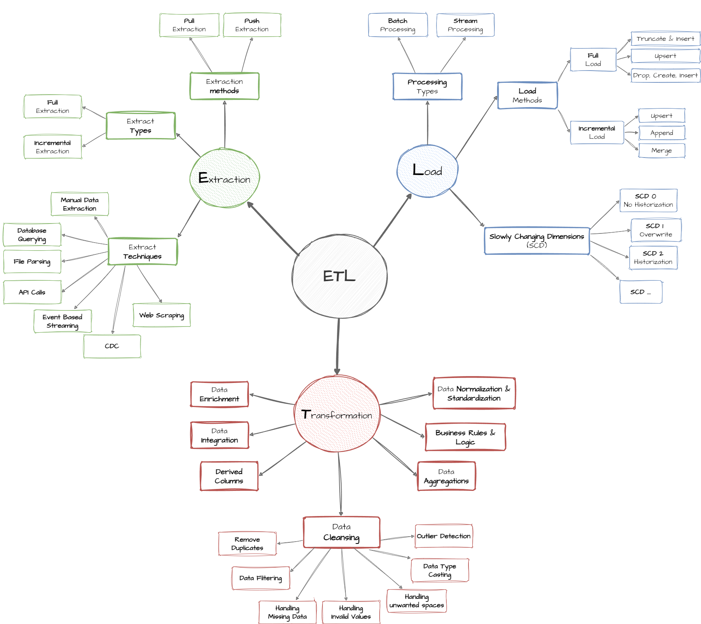

<div align="center">
  
# 🏙️ Smart City Data Warehouse Project

**A comprehensive data engineering project showcasing the construction of a data warehouse for a "Smart City" using multiple ETL technologies.**

</div>

<p align="center">
  
  
  
  
</p>

This project demonstrates the end-to-end process of building a data warehouse. It begins with raw, source data from various city services and transforms it into a structured **Galaxy Schema** optimized for analytics and business intelligence. The unique aspect of this repository is that it implements the same data pipeline using three different technology stacks, plus an orchestration layer with Airflow.

---

## ✨ Key Features

-   **Multi-Technology Implementation**: Solve the same problem with T-SQL, Python, and Talend.
-   **Medallion Architecture**: Data is progressively refined through Bronze, Silver, and Gold layers.
-   **SCD Type 2**: Demonstrates handling of Slowly Changing Dimensions to track historical data.
-   **Orchestration**: Includes an Apache Airflow setup to schedule and monitor Talend jobs.
-   **Comprehensive Documentation**: Detailed `md` files for each implementation.

---

## 🏛️ Architecture Overview

The core of this project is the **Medallion Architecture**, which ensures data quality and governance by moving data through distinct layers. The final `Gold` layer presents the data in a user-friendly Galaxy Schema.



<br/>

<details>
<summary><strong>Table of Contents</strong></summary>

1.  [🎨 Design & Prototyping](#-design--prototyping)
2.  [🛠️ Technologies Used](#️-technologies-used)
3.  [📂 Project Structure](#-project-structure)
4.  [🚀 ETL Implementations & Orchestration](#-etl-implementations--orchestration)
    -   [Talend ETL](#1-talend-etl)
    -   [SQL-based ETL](#2-sql-based-etl-medallion-architecture)
    -   [Python-based ETL](#3-python-based-etl-medallion-architecture)
    -   [Airflow Orchestration](#4-airflow-orchestration-for-talend-jobs)
5.  [📚 Detailed Documentation](#-detailed-documentation)

</details>

---

## 🎨 Design & Prototyping

The conceptual design, data modeling, and UI mockups for this project were planned using the following tools:

-   **Figma Board:** [🔗 Smart City Project on Figma](https://www.figma.com/board/g4Z7tSYQAf4TSLCS85Lnv3/Smart_City?node-id=0-1&t=552hIgLDw6xeHc7n-1)
-   **Canva Design:** [🔗 Smart City Project on Canva](https://www.canva.com/design/DAGzeqoUblE/utDSNvIL1xt6Bf1s2339Ug/edit?utm_content=DAGzeqoUblE&utm_campaign=designshare&utm_medium=link2&utm_source=sharebutton)

---

## 🛠️ Technologies Used

-   **Database**: Microsoft SQL Server
-   **ETL (Visual)**: Talend Open Studio
-   **ETL (Programmatic)**: Python 3, Pandas, SQLAlchemy
-   **Orchestration**: Apache Airflow
-   **Data Modeling**: Galaxy Schema, Medallion Architecture (Bronze, Silver, Gold)

---

## 📊 Dataset & Data Generation

This project includes a comprehensive dataset representing various smart city services. The data is generated using Python scripts and covers:

### Data Categories
-   **🏢 Buildings**: Properties, locations, and ownership information
-   **📅 Calendar**: Date dimensions with hierarchical time data
-   **🚌 Transportation**: Bus routes, GPS tracking, and schedules  
-   **⚡ Energy**: Power consumption and device monitoring
-   **🚨 Emergency**: Emergency calls and response tracking
-   **🚛 Waste Management**: Collection routes and container monitoring
-   **🚦 Traffic**: Vehicle counts and speed monitoring
-   **📱 IoT Devices**: Sensor data and device metadata

### Data Generation Scripts
Located in the `datasets/` directory:
-   `generate_dimension_data.py` - Creates dimension table data
-   `generate_fact_data.py` - Generates transactional fact data  
-   `generate_static_data.py` - Produces reference/lookup data

<details>
<summary><strong>Generate Sample Data</strong></summary>

```bash
cd datasets/
python generate_dimension_data.py
python generate_fact_data.py  
python generate_static_data.py
```

This will populate the `silver_data/` folder with fresh CSV files.
</details>

---
## 🏗️ Database Schema Overview

The data warehouse implements a **Galaxy Schema** with the following structure:

### Dimension Tables
-   `dim_buildings` - Building information (SCD Type 2)
-   `dim_calendar` - Date hierarchy
-   `dim_devices` - IoT device catalog
-   `dim_trucks` - Waste collection vehicles
-   `dim_zones` - City geographical zones
-   `dim_bus_routes` - Public transportation routes
-   `dim_event_types` - Emergency event classifications

### Fact Tables  
-   `fact_bus_gps` - Real-time bus location tracking
-   `fact_emergency_calls` - Emergency incident records
-   `fact_energy_consumption` - Building power usage
-   `fact_traffic` - Traffic flow measurements
-   `fact_waste_collection` - Waste pickup operations

*Note: Detailed schema documentation is available in [Meta Data Definition](./docs/meta_data_definition.md)*

---

## 💼 Business Use Cases

This data warehouse enables various smart city analytics scenarios:

### 🚨 Public Safety
-   **Emergency Response Optimization**: Analyze response times by zone and event type
-   **Resource Allocation**: Identify high-incident areas for better service deployment
-   **Pattern Recognition**: Detect seasonal or temporal emergency trends

### 🚌 Transportation Management  
-   **Route Optimization**: Analyze bus GPS data to improve schedules
-   **Traffic Flow Analysis**: Monitor congestion patterns and optimize signal timing
-   **Public Transit KPIs**: Track on-time performance and passenger load factors

### ⚡ Energy Management
-   **Consumption Monitoring**: Track building energy usage patterns
-   **Demand Forecasting**: Predict energy needs based on historical data
-   **Efficiency Programs**: Identify buildings for energy-saving initiatives

### 🗂️ Waste Management
-   **Collection Optimization**: Optimize truck routes based on container fill levels
-   **Operational Efficiency**: Monitor collection crew productivity
-   **Environmental Impact**: Track waste generation patterns by zone

---

## 📂 Project Structure

```
.
├── Smart_City_Airflow/ # Airflow DAGs and Talend Job exports
├── data_with_python/   # Python-based ETL implementation
├── data_with_sql/      # SQL-based ETL implementation
├── data_with_talend/   # DDLs for Talend implementation
├── datasets/           # Source CSV data files
├── docs/               # Detailed documentation for each module
└── README.md           # This file
```

---

## 🚀 ETL Implementations & Orchestration

This project offers four ways to process and manage the data pipeline.

### 1. Talend ETL

A visual ETL process designed in Talend Open Studio. Ideal for users who prefer a low-code, graphical interface for building data pipelines.

<details>
<summary><strong>More Info</strong></summary>
<br/>

-   **Location:** `data_with_talend/`
-   **Description:** This directory contains the DDLs for setting up the source (`SmartCity`) and destination (`SmartCityDWH`) databases. The actual Talend jobs are visually designed and are not stored as code in this repository, but their execution is orchestrated by Airflow.
-   **Documentation:** `docs/talend_documentation.md` explains the logic of the Talend jobs with screenshots.

</details>

### 2. SQL-based ETL (Medallion Architecture)

A pure T-SQL implementation that uses stored procedures to move and transform data through the Bronze, Silver, and Gold layers within the data warehouse itself.

<details>
<summary><strong>Click to see How to Run</strong></summary>
<br/>

1.  Execute `data_with_sql/init_database.sql` to create the `SmartCityDWH` database and schemas.
2.  Run the DDL scripts in `bronze/`, `silver/`, and `gold/` to create the tables.
3.  Execute the stored procedures in order:
    ```sql
    EXEC bronze.load_bronze;
    EXEC silver.load_silver;
    EXEC gold.proc_load_gold;
    ```
-   **Documentation:** See `docs/sql_etl_documentation.md` for a detailed breakdown.

</details>

### 3. Python-based ETL (Medallion Architecture)

A programmatic ETL pipeline using Python and Pandas. This approach offers flexibility, testability, and is well-suited for complex transformations.

<details>
<summary><strong>Click to see How to Run</strong></summary>
<br/>

1.  **Install dependencies:**
    ```bash
    pip install -r data_with_python/requirements.txt
    ```
2.  **Configure DB:** Copy `data_with_python/.env.example` to `.env` and fill in your database credentials.
3.  **Execute:** Navigate to the `data_with_python` directory and run the main pipeline script:
    ```bash
    python main.py
    ```
-   **Documentation:** See `docs/python_etl_documentation.md` for a detailed breakdown.

</details>

### 4. Airflow Orchestration for Talend Jobs

An Apache Airflow setup to automate, schedule, and monitor the execution of the master Talend job.

<details>
<summary><strong>Click to see How to Use</strong></summary>
<br/>

1.  Export your master Talend job (`Run_All_Jobs_Smart_City_ETL`) as a standalone executable.
2.  Place the exported job folder in a designated directory on your Airflow machine (e.g., `/opt/airflow/jobs/`).
3.  Deploy the `smart_city_etl_dag.py` script to your Airflow `dags` folder.
4.  Airflow will manage the entire pipeline via the `smart_city_etl` DAG.
-   **Documentation:** See `docs/airflow_orchestration.md` for a detailed breakdown.

</details>

---

## 🎯 Future Enhancements

Planned improvements for upcoming versions:

### Technical Enhancements
-   ☁️ **Cloud Migration**: Azure Data Factory / AWS Glue implementations
-   📊 **Real-time Streaming**: Apache Kafka integration for live data
-   🔄 **CI/CD Pipeline**: Automated testing and deployment
-   📱 **Mobile Dashboard**: Power BI / Tableau integration examples

### Data Enhancements  
-   🌍 **Geospatial Analysis**: Integration with GIS data and mapping
-   🤖 **Machine Learning**: Predictive models for city planning
-   📈 **Advanced Analytics**: Complex KPIs and trend analysis
-   🔗 **External APIs**: Integration with weather, social media data

### Architecture Improvements
-   🐳 **Containerization**: Docker containers for easy deployment
-   ⚖️ **Scalability**: Partitioning strategies for large datasets
-   🔐 **Security**: Data encryption and access control examples
-   📊 **Data Quality**: Automated data validation and monitoring

---

## 📚 Detailed Documentation

For a deeper dive into each implementation, please refer to the documentation files in the `docs/` directory:

-   [Talend ETL Documentation](./docs/talend_documentation.md)
-   [SQL ETL Documentation](./docs/sql_etl_documentation.md)
-   [Python ETL Documentation](./docs/python_etl_documentation.md)
-   [Airflow Orchestration Documentation](./docs/airflow_orchestration.md)
-   [Meta Data Definition](./docs/meta_data_definition.md)
