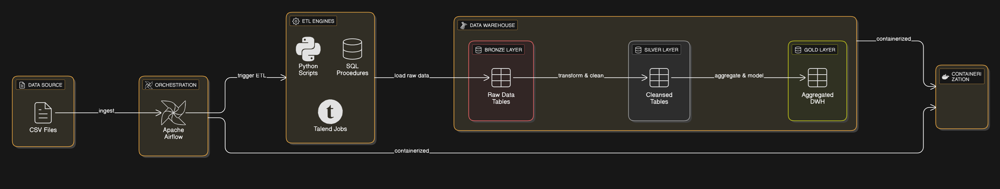

# Smart City Project Architecture

This document outlines the system architecture for the Smart City data processing project. The architecture is designed as a batch processing ETL pipeline orchestrated by Apache Airflow, leveraging a Medallion Architecture for data storage and processing.

## System Components

The architecture consists of the following main components:

1.  **Data Source**: The initial data is provided as CSV files located in the `datasets/` directory. This represents the raw, unprocessed data from various smart city sensors and systems.

2.  **Orchestrator**: **Apache Airflow** is used to schedule, orchestrate, and monitor the ETL workflows. The DAG definitions in `Smart_City_Airflow/` control the entire data flow, ensuring tasks are executed in the correct order and handling dependencies and retries.

3.  **ETL Engines**: The project utilizes a polyglot approach for ETL (Extract, Transform, Load) processes, with three different implementation methods:
    *   **Python Scripts**: Custom Python scripts located in `data_with_python/` for data processing.
    *   **SQL Procedures**: Stored procedures and DDL scripts in `data_with_sql/` for database-centric transformations.
    *   **Talend Jobs**: Pre-compiled Talend jobs, packaged and executed via scripts within the Airflow environment.

4.  **Data Warehouse (SQL Server)**: A SQL Server database serves as the central data warehouse. It is structured using the **Medallion Architecture**, which separates data into three logical layers:
    *   **Bronze Layer**: Stores raw data ingested directly from the source CSV files with minimal changes. This layer provides a historical archive of the raw data.
    *   **Silver Layer**: Contains cleaned, validated, and enriched data. Data from the Bronze layer is transformed and loaded into the Silver layer, where it is modeled into structured tables (e.g., dimensions and facts).
    *   **Gold Layer**: Holds highly aggregated and refined data, ready for business intelligence (BI), analytics, and reporting. This layer provides the data for final analysis and visualization.

5.  **Containerization**: **Docker** is used to containerize the entire environment, including Apache Airflow and SQL Server. This ensures consistency, portability, and isolation across different development and production environments.

## Data Flow

The data flows through the system as follows:

1.  **Ingestion**: Airflow triggers a DAG run based on a defined schedule. The first tasks in the DAG read the source **CSV files**.
2.  **Execution**: Airflow executes the ETL tasks, which can be **Python scripts, SQL procedures, or Talend jobs**.
3.  **Load to Bronze**: The ETL jobs load the raw data from the CSV files into the **Bronze layer** tables in the SQL Server data warehouse.
4.  **Transform to Silver**: Subsequent tasks transform and clean the data from the Bronze tables and load it into the **Silver layer**. This step involves data validation, deduplication, and structuring the data into facts and dimensions.
5.  **Aggregate to Gold**: Finally, data from the Silver layer is aggregated and loaded into the **Gold layer**, creating the final data marts for analytics and reporting.

This architecture provides a robust and scalable solution for the Smart City project's data processing needs.
