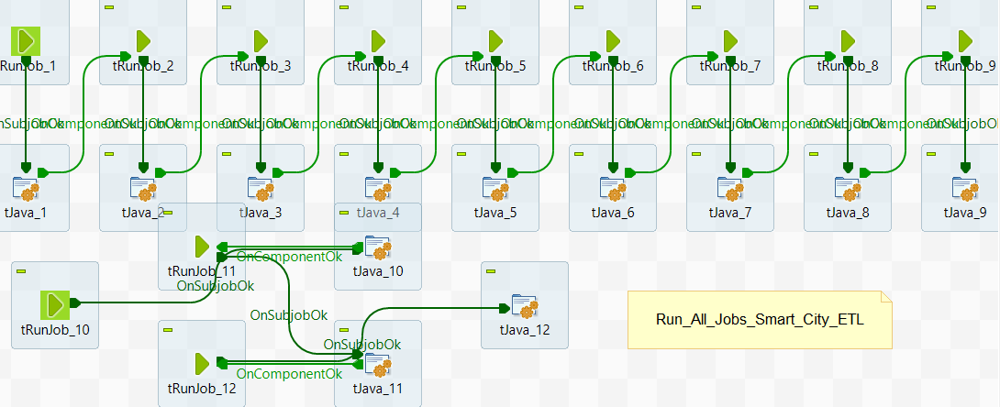
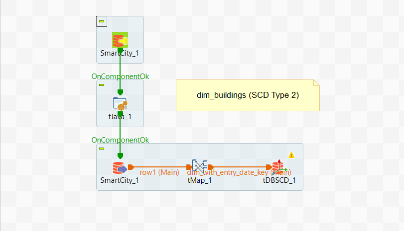
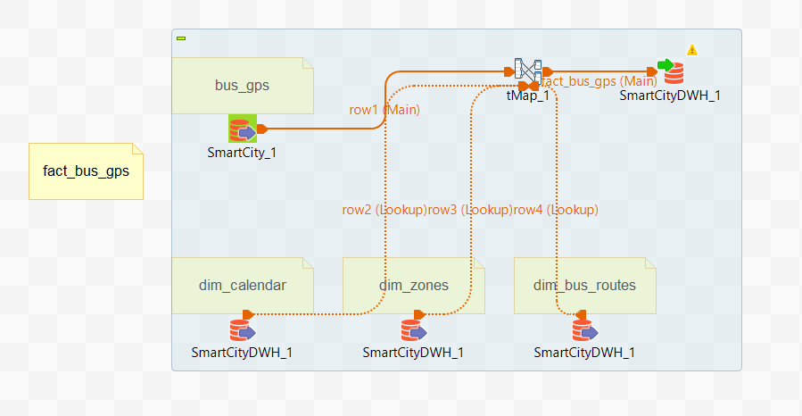

# Smart City ETL Project Documentation using Talend

## Overview

This document provides a detailed explanation of the ETL (Extract, Transform, Load) process designed using Talend. The goal of this project is to build a Data Warehouse for a smart city, enabling the analysis of various data such as energy consumption, traffic, and bus locations.

Data is extracted from an operational (OLTP) database named `SmartCity`, then transformed, cleaned, and loaded into the `SmartCityDWH` data warehouse, which is designed with a Galaxy Schema model.

---

## Master Job Orchestration

To simplify execution and ensure the correct order of operations, a master job named `Run_All_Jobs_Smart_City_ETL` was created in Talend. This job orchestrates the entire ETL pipeline by running all the individual dimension and fact loading jobs in the correct sequence.

-   **Purpose**: Acts as a single entry point for the entire ETL process.
-   **Logic**: Uses `tRunJob` components to call each child job (e.g., `into_data_into_dim_buildings`, `into_data_into_fact_bus_gps`) in a specific order, ensuring that dimensions are loaded before the facts that depend on them.
-   **Benefit**: This approach centralizes control and simplifies scheduling, as only this one master job needs to be executed.

---

## Individual Job Patterns

The master job calls a series of individual child jobs. The full project contains a separate job for each dimension and fact table. The jobs detailed below are **examples** that demonstrate the two primary patterns used throughout the project:

1.  **SCD Type 2 Pattern** for dimensions that require historical tracking.
2.  **Fact with Dimension Lookup Pattern** for fact tables.

### Example 1: `dim_buildings` (SCD Type 2 Pattern)

#### Purpose

This job is responsible for loading and processing building data into the `dim_buildings` table. It uses the Slowly Changing Dimension (SCD) Type 2 technique to maintain a history of changes to the building data.

#### Components Used

1.  **`SmartCity` (tDBInput):** Reads building data from the `buildings` table in the `SmartCity` source database.
2.  **`tJava` (tJava):** Used to execute Java code. In this case, it initializes context variables or sets up values before the loading process, such as `entry_date_key`.
3.  **`tMap` (tMap):** Maps the source fields to the target fields.
4.  **`tDBSCD` (tDBSCD):** The core component for implementing SCD Type 2. It performs the following tasks:
    -   **Source Key:** `building_id` (the business key).
    -   **Surrogate Key:** `building_sk` (the auto-generated surrogate key).
    -   **Start Date & End Date:** `valid_from` and `valid_to` to define the validity period of each record.
    -   **Version:** `is_current` to identify the current record.

#### Logic

1.  All records are read from the source `buildings` table.
2.  For each record, the `tDBSCD` component checks if the `building_id` already exists in `dim_buildings`.
3.  **If the record is new:** It is inserted as a new record with `is_current = 1` and `valid_to = NULL`.
4.  **If the record exists and its data has changed:**
    -   The old record is updated by setting `is_current = 0` and `valid_to` to the current date.
    -   A new record is inserted with the same `building_id` and the updated data, with `is_current = 1` and `valid_to = NULL`.

---

### Example 2: `fact_bus_gps` (Fact with Dimension Lookup Pattern)

#### Purpose

This job is responsible for loading bus GPS tracking data into the `fact_bus_gps` fact table. This table combines measurements (like speed and location) with various dimension keys (like date, zone, and bus route).

#### Components Used

1.  **`bus_gps` (tDBInput):** Reads bus tracking data from the `bus_gps` table in the `SmartCity` source database.
2.  **`dim_calendar`, `dim_zones`, `dim_bus_routes` (tDBInput):** Lookup components that read dimension tables from `SmartCityDWH` to retrieve their surrogate keys.
3.  **`tMap_1` (tMap):** The central component in this job, which performs the following:
    -   **Join:** Joins the incoming `bus_gps` data with the dimension tables (`dim_calendar`, `dim_zones`, `dim_bus_routes`) using business keys like `date_key`, `zone_id`, and `route_id`.
    -   **Mapping:** Replaces the business keys with their corresponding surrogate keys (e.g., `date_sk`, `zone_sk`, `route_sk`) and passes the measures to the target table.
4.  **`fact_bus_gps` (tDBOutput):** Loads the transformed data into the `fact_bus_gps` table in `SmartCityDWH`.

#### Logic

1.  The `bus_gps` data is read as the main data flow.
2.  For each record in `bus_gps`, `tMap` performs a lookup on the dimension tables to find the corresponding surrogate keys.
3.  For example, the `date_key` from the `bus_gps` table is used to look up the `date_sk` in `dim_calendar`.
4.  The surrogate keys are combined with the measures (like `speed_kmh`, `occupancy_est`) into a single data flow.
5.  Finally, this combined data is loaded into the `fact_bus_gps` table.

---

### General Logic for Other Jobs

-   **Other Dimension Tables**: Dimensions that do not require history tracking (e.g., `dim_zones`, `dim_devices`) are loaded using a simple SCD Type 1 pattern (Insert/Update), which is a simplified version of the `dim_buildings` job.
-   **Other Fact Tables**: All other fact tables (e.g., `fact_emergency_calls`, `fact_traffic`) follow the same lookup pattern demonstrated in the `fact_bus_gps` job. They read from a source fact table, look up the surrogate keys from all relevant dimension tables, and then insert the final record into the gold layer.
