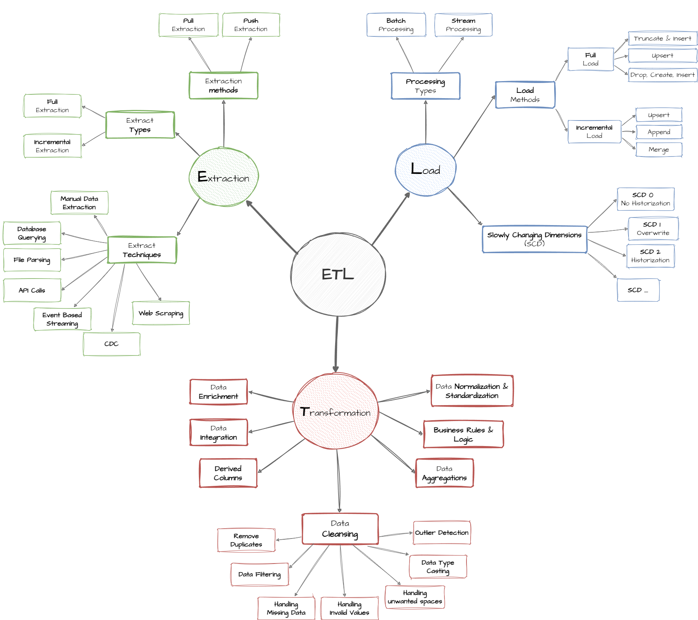

# Smart City SQL ETL Project Documentation

## Overview

This document provides a detailed explanation of the SQL-based ETL (Extract, Transform, Load) process for the Smart City data warehouse. The project follows a **Medallion Architecture** (Bronze, Silver, Gold) to progressively refine and structure the data, making it suitable for analytics and reporting.

The entire process is orchestrated through SQL scripts and stored procedures within a single database, `SmartCityDWH`.

---

## Architecture and Data Flow

The ETL process is divided into three distinct layers (schemas):

1.  **Bronze (Raw Data):** Ingests raw data from source files without any transformation.
2.  **Silver (Cleansed & Conformed):** Cleans the data and applies light transformations.
3.  **Gold (Presentation):** Models the data into a galaxy schema for analytics.

  
*Note: This is a conceptual diagram; the actual flow is managed by SQL procedures.*

### Initialization

-   **Script:** `init_database.sql`
-   **Purpose:** This script prepares the environment by creating the `SmartCityDWH` database and the `bronze`, `silver`, and `gold` schemas. **Warning:** It will drop the database if it already exists.

---

### 1. Bronze Layer (Raw Ingestion)

The Bronze layer is the landing zone for all incoming data. Its primary purpose is to create a persistent raw data lake within the data warehouse.

-   **DDL Script:** `bronze/ddl_bronze.sql`
    -   **Action:** Creates all the necessary tables within the `bronze` schema. The table structures mirror the columns in the source CSV files, with data types set to be accommodating (e.g., `NVARCHAR`, `FLOAT`).
-   **ETL Script:** `bronze/proc_load_bronze.sql`
    -   **Action:** This stored procedure (`bronze.load_bronze`) handles the "Extract" part of the ETL.
    -   It first **truncates** all tables in the bronze schema to ensure a fresh load.
    -   It then uses the `BULK INSERT` command to load data directly from the `.csv` files located in the `datasets` directory into the corresponding bronze tables.
    -   No data cleansing or transformation occurs at this stage.

---

### 2. Silver Layer (Cleansing and Conforming)

The Silver layer takes the raw data from the Bronze layer and applies basic cleansing and data quality rules. The goal is to have a more reliable, queryable version of the data.

-   **DDL Script:** `silver/ddl_silver.sql`
    -   **Action:** Creates tables in the `silver` schema that are structurally identical to the bronze tables, with the addition of a `dwh_create_date` column to track when the record was processed.
-   **ETL Script:** `silver/proc_load_silver.sql`
    -   **Action:** This stored procedure (`silver.load_silver`) handles the "Transform" part of the ETL.
    -   It first **truncates** all tables in the silver schema.
    -   It then reads data from the bronze tables and inserts it into the silver tables.
    -   **Transformations:**
        -   **Data Cleansing:** Basic cleansing is applied. For example, `NULLIF(TRIM(column), '')` is used on certain foreign key columns (like `building_id`, `truck_id`) to convert empty strings into proper `NULL` values. This improves data integrity for later joins.
        -   **No Structural Changes:** The schema and relationships between tables remain largely the same as in the bronze layer.

---

### 3. Gold Layer (Presentation Model)

The Gold layer is the final, highly refined, and aggregated layer. The data is modeled into a classic galaxy schema, which is optimal for business intelligence and analytics.

-   **DDL Script:** `gold/ddl_gold_dwh.sql`
    -   **Action:** Creates the final data warehouse model in the `gold` schema.
    -   **Dimension Tables (`dim_*`):** Creates dimension tables like `dim_buildings`, `dim_calendar`, etc. These tables contain descriptive attributes. Surrogate keys (e.g., `building_sk`) are added as primary keys, typically as `IDENTITY` columns.
    -   **Fact Tables (`fact_*`):** Creates fact tables like `fact_bus_gps`, `fact_energy_consumption`, etc. These tables contain numeric measures and foreign keys referencing the dimension tables.
    -   **Relationships:** Defines foreign key constraints between fact and dimension tables to enforce referential integrity.

-   **ETL Script:** `gold/proc_load_gold.sql`
    -   **Action:** This complex stored procedure (`gold.proc_load_gold`) loads the Silver data into the Gold galaxy schema.
    -   **Loading Dimensions (Non-SCD):** For most dimensions (`dim_zones`, `dim_devices`, etc.), it performs an incremental load. It inserts records from the silver layer if they do not already exist in the gold dimension (checked via the business key).
    -   **Loading `dim_buildings` (SCD Type 2):**
        -   The `dim_buildings` table is handled using a Slowly Changing Dimension Type 2 strategy to track historical changes.
        -   **Step 1:** It identifies records in `silver.buildings` that have changed compared to the current version in `gold.dim_buildings`.
        -   **Step 2:** For changed records, it **expires** the old record in the gold table by setting `is_current = 0` and updating the `valid_to` date.
        -   **Step 3:** It **inserts** a new record with the updated information, setting `is_current = 1` and `valid_from` to the current date.
    -   **Loading Fact Tables:**
        -   The fact tables are truncated and reloaded in this implementation.
        -   Data is inserted by joining the silver fact data with the gold dimension tables to look up the correct surrogate keys (e.g., joining `silver.bus_gps` with `gold.dim_calendar` on `date_key` to get `date_sk`).
        -   For SCD Type 2 dimensions like `dim_buildings`, the join is time-aware, ensuring that the fact record is linked to the version of the dimension record that was valid at the time the event occurred (e.g., `s.reported_at >= d_b.valid_from AND s.reported_at < ISNULL(d_b.valid_to, '9999-12-31')`).
