# 🏙️ SmartCity Data Pipeline

<div align="center">

[](https://www.docker.com/)
[](https://spark.apache.org/)
[](https://airflow.apache.org/)
[](https://www.microsoft.com/sql-server)
[](https://trino.io/)
[](https://hive.apache.org/)
[](https://hadoop.apache.org/)

**End-to-end data warehouse pipeline: SQL Server → Spark → Hive → Trino**

[Quick Start](#-quick-start) • [Architecture](#-architecture) • [Data Model](#-data-model) • [Documentation](docs/)

</div>

---

## 📊 Architecture


---

## 🛠️ Components

| Component | Version | Purpose | Port |
|-----------|---------|---------|------|
| **SQL Server** | 2022 | Source data warehouse | 1433 |
| **Apache Spark** | 3.3.0 | Batch ETL processing | 8080 (UI), 7077 |
| **Apache Hive** | 2.3.2 | Data lake storage | 10000, 9083 |
| **Trino** | 434 | SQL query engine | 8084 |
| **Apache Airflow** | 2.7.3 | Workflow orchestration | 8082 |
| **HDFS** | 3.3.5 | Distributed file storage | 9870 (UI), 9000 |
| **Redis** | Latest | Celery message broker | 6379 |
| **PostgreSQL** | 13 | Airflow metadata DB | 5432 |

---

## 📊 Data Model

### Dimension Tables
| Table | Records | Description |
|-------|---------|-------------|
| `dim_buildings` | 301 | Building information & metadata |
| `dim_zones` | 6 | City geographic zones |
| `dim_bus_routes` | 10 | Public transit route definitions |
| `dim_calendar` | 30 | Date dimension table |
| `dim_devices` | 602 | IoT device registry |
| `dim_event_types` | 7 | Emergency event categories |
| `dim_trucks` | 16 | Waste collection fleet |

### Fact Tables
| Table | Records | Description |
|-------|---------|-------------|
| `fact_traffic` | 110,000 | Traffic sensor readings |
| `fact_bus_gps` | 508,400 | Bus GPS tracking data |
| `fact_energy_consumption` | 432,000 | Building energy usage |
| `fact_emergency_calls` | 780 | Emergency call records |
| `fact_waste_collection` | 0 | Waste collection events |

**Total Records**: ~1,051,000

---

## 🚀 Quick Start

### Prerequisites
```bash
# Required
- Docker Engine 20.10+
- Docker Compose 2.0+
- 16GB+ RAM recommended
- 20GB+ free disk space
```

### Start the Pipeline

```bash
# Navigate to project
cd Smart_City_Pipeline_2_Milestone_2

# Start all services
docker compose up -d

# Wait for services to be healthy (2-3 minutes)
docker compose ps
```

### Access Web UIs

| Service | URL | Credentials |
|---------|-----|-------------|
| **Airflow** | http://localhost:8082 | admin / admin |
| **Spark Master** | http://localhost:8080 | - |
| **HDFS NameNode** | http://localhost:9870 | - |
| **Jupyter Notebook** | http://localhost:8888 | - |

---

## 📁 File Structure

```
Smart_City_Pipeline_2_Milestone_2/
├── docker-compose.yml          # Infrastructure definition (25+ containers)
├── docker-compose.env          # Environment variables
├── airflow/
│   ├── dags/
│   │   ├── smartcity_dwh_pipeline.py   # Main ETL DAG
│   │   └── sample_pyspark_job.py       # Sample Spark job
│   ├── config/                 # Airflow configuration
│   ├── logs/                   # Execution logs
│   └── plugins/                # Custom plugins
├── scripts/
│   ├── pyspark/
│   │   └── smartcity_dwh_etl.py        # Spark ETL script
│   └── restore_dwh.sh          # DB restore automation
├── sql/
│   └── SmartCityDWH.bak        # SQL Server backup file
├── trino/
│   └── config/
│       ├── config.properties
│       ├── node.properties
│       ├── jvm.config
│       └── catalog/
│           └── hive.properties
└── docs/
    ├── BUILD_FROM_SCRATCH.md
    ├── STARTUP_GUIDE.md
    └── TEST_RESULTS.md
```

---

## 🔄 Airflow DAG: smartcity_dwh_pipeline

The main DAG orchestrates the complete ETL pipeline with  12 tasks:

```mermaid
flowchart TB
    A[wait_for_sqlserver<br/>Health Check] --> B[restore_dwh_backup<br/>Restore DB]
    B --> C[verify_restore<br/>Validate Tables]
    C --> D[wait_for_spark<br/>Check Spark]
    C --> E[wait_for_hive<br/>Check Hive]
    D --> F[setup_jdbc_driver<br/>Install Driver]
    E --> G[create_hive_database<br/>Create DB]
    F --> H[run_spark_etl<br/>⚡ Main ETL Job]
    G --> H
    H --> I[verify_hive_tables<br/>Validate Load]
    I --> J[test_trino_queries<br/>Test Queries]
    J --> K[generate_sample_report<br/>Create Report]
    K --> L[pipeline_complete<br/>✅ Done]

    style A fill:#FFE5CC,stroke:#FF9900
    style B fill:#FFE5CC,stroke:#FF9900
    style C fill:#FFE5CC,stroke:#FF9900
    style H fill:#E25A1C,color:#fff,stroke:#E25A1C,stroke-width:3px
    style I fill:#FDEE21,stroke:#000
    style J fill:#DD00A1,color:#fff,stroke:#DD00A1
    style L fill:#4CAF50,color:#fff,stroke:#4CAF50
```



**Pipeline Duration**: ~4-6 minutes  
**Critical Path**: Spark ETL job takes ~4 minutes

---

## ✨ Features

### Core Capabilities

- **📊 Complete ETL Pipeline**: Automated data extraction from SQL Server to Hive via Spark
- **🔄 Workflow Orchestration**: Apache Airflow manages 12-task DAG with dependency handling
- **⚡ Batch Processing**: Apache Spark 3.3.0 processes 1M+ records in ~4 minutes
- **🗄️ Data Warehousing**: Apache Hive 2.3.2 with Parquet storage for analytics
- **🔍 SQL Query Engine**: Trino provides fast SQL interface to Hive data
- **📦 Distributed Storage**: HDFS 3.3.5 with 3x replication for fault tolerance
- **🎯 Star Schema**: Optimized dimensional model with 7 dim + 5 fact tables
- **🐳 Containerized**: 25+ Docker containers for complete infrastructure
- **📈 Scalable Architecture**: Horizontal scaling for Spark workers and HDFS datanodes
- **🔌 JDBC Connectivity**: Direct connection between Spark and SQL Server

### Data Processing

- **Dimension Tables**: 7 tables (Buildings, Zones, Routes, Calendar, Devices, Event Types, Trucks)
- **Fact Tables**: 5 tables (Traffic, Bus GPS, Energy, Emergency Calls, Waste Collection)
- **Record Volume**: 1,051,146 total records
- **Data Format**: Parquet (columnar format for analytics)
- **Partitioning**: Date-based partitioning for optimized queries

### Monitoring & Observability

- **Web UIs**: Airflow (8082), Spark (8080), HDFS (9870), Jupyter (8888)
- **Centralized Logging**: Airflow task logs in `/airflow/logs`
- **Health Checks**: Docker health checks for critical services
- **DAG Monitoring**: Real-time task status in Airflow UI

---

## 🎯 Use Cases

### Smart City Analytics

**Traffic Optimization**
- Analyze traffic patterns across 6 city zones
- Identify congestion hotspots (110,000 readings)
- Optimize signal timing based on vehicle counts

**Energy Management**
- Monitor building energy consumption (432,000 readings)
- Compare consumption by building type (Malls: 299kWh vs Residential: 3.25kWh)
- Detect anomalies and optimize usage

**Public Transportation**
- Track bus GPS data in real-time (508,400 readings)
- Optimize 10 bus routes (average distance: 7.23 km)
- Improve schedule adherence

**Emergency Services**
- Analyze emergency call patterns (780 records)
- Identify high-incident zones
- Optimize resource allocation

**Waste Management**
- Track waste collection fleet (16 trucks)
- Optimize collection routes
- Monitor service levels

### Data Engineering Learning

- **Pipeline Development**: Learn modern data engineering stack
- **Workflow Orchestration**: Master Airflow DAG development
- **Big Data Processing**: Practice Spark ETL jobs
- **Data Warehousing**: Understand star schema design
- **SQL Analytics**: Query large datasets with Trino
- **Containerization**: Deploy complex multi-container applications

---

## 📈 Performance Metrics

### Processing Performance

| Metric | Value | Details |
|--------|-------|---------|
| **ETL Duration** | ~4-6 minutes | Complete SQL Server → Hive pipeline |
| **Throughput** | ~4,000 records/sec | During Spark ETL job |
| **Data Volume** | 1.05M records | Across 12 tables |
| **Query Latency** | < 3 seconds | Trino analytical queries |
| **Startup Time** | 2-3 minutes | All 25+ containers initialized |

### Resource Utilization

| Resource | Development | Recommended Production |
|----------|-------------|------------------------|
| **RAM** | 8-12 GB | 32+ GB |
| **CPU** | 2-4 cores | 8+ cores |
| **Disk** | 20 GB | 100+ GB |
| **Network** | Local | 10 Gbps+ |

### Scalability


**Scaling Options**:
- **Horizontal**: Add more Spark workers (`docker-compose scale spark-worker=4`)
- **Vertical**: Increase memory allocations in `docker-compose.yml`
- **Storage**: Add HDFS datanodes for larger datasets

---

## 🛠️ Technology Stack

### Data Technologies

| Technology | Version | Role | Why Chosen |
|-----------|---------|------|------------|
| **Apache Spark** | 3.3.0 | ETL Engine | Industry standard for big data processing, supports batch and streaming |
| **Apache Hive** | 2.3.2 | Data Warehouse | SQL interface, Parquet storage, integrates with Hadoop ecosystem |
| **Trino** | 434 | Query Engine | Fast SQL queries, connects to multiple data sources |
| **HDFS** | 3.3.5 | Distributed Storage | Fault-tolerant, scalable storage for big data |
| **SQL Server** | 2022 | Source Database | Enterprise-grade RDBMS, supports advanced features |

### Orchestration & Infrastructure

| Technology | Version | Role | Why Chosen |
|------------|---------|------|------------|
| **Apache Airflow** | 2.7.3 | Workflow Orchestration | Programmable workflows, rich UI, strong community |
| **Docker** | 20.10+ | Containerization | Consistent environments, easy deployment |
| **PostgreSQL** | 13 | Airflow Metadata | Reliable metadata store for Airflow |
| **Redis** | Latest | Message Broker | Fast Celery executor backend for Airflow |

### Configuration

```yaml
# Key Spark Configuration
spark.executor.memory: 2g
spark.driver.memory: 2g  
spark.sql.shuffle.partitions: 200

# HDFS Configuration
dfs.replication: 3
dfs.namenode.handler.count: 10

# Hive Configuration
hive.metastore.warehouse.dir: /user/hive/warehouse
```

---

## 🔧 Troubleshooting

### Common Issues & Solutions

<details>
<summary><strong>🔴 Airflow tasks stuck in "queued"</strong></summary>

**Symptoms**: Tasks remain in "queued" state indefinitely

**Root Cause**: Redis not on same Docker network as Airflow

**Solution**:
```yaml
# In docker-compose.yml, ensure Redis has:
redis:
  networks:
    - kafka-net  # Add this network
```

**Verify**:
```bash
docker exec data-pipeline-compose-airflow-worker-1 redis-cli -h redis ping
# Should return: PONG
```

</details>

<details>
<summary><strong>🔴 SQL Server restore fails</strong></summary>

**Symptoms**: Database restore command fails

**Root Cause**: Using SQL Server 2019 instead of 2022

**Solution**:
```yaml
sqlserver:
  image: mcr.microsoft.com/mssql/server:2022-latest  # Not 2019
```

**Verify**:
```bash
docker exec sqlserver /opt/mssql-tools18/bin/sqlcmd -S localhost -U sa -P 'SmartCity@2024!' -C -Q "SELECT @@VERSION"
```

</details>

<details>
<summary><strong>🔴 Spark can't connect to SQL Server</strong></summary>

**Symptoms**: Spark job fails with JDBC connection error

**Root Cause**: JDBC driver not installed on Spark nodes

**Solution**:
```bash
# Install on all Spark nodes
for node in spark-master spark-worker-1 spark-worker-2; do
  docker exec $node wget -P /spark/jars/ \
    https://repo1.maven.org/maven2/com/microsoft/sqlserver/mssql-jdbc/12.4.2.jre8/mssql-jdbc-12.4.2.jre8.jar
done
```

**Verify**:
```bash
docker exec spark-master ls -la /spark/jars/ | grep mssql
```

</details>

<details>
<summary><strong>🔴 Trino queries fail</strong></summary>

**Symptoms**: Trino returns connection errors

**Root Cause**: Trino not fully initialized

**Solution**: Wait 30-60 seconds after container start

**Check Logs**:
```bash
docker logs trino-coordinator --tail 50
# Look for "SERVER STARTED"
```

</details>

### Troubleshooting Flowchart


---

## ❓ FAQ

**Q: How long does the complete pipeline take to run?**  
A: Initial setup: ~15 minutes. Daily run (incremental): ~4-6 minutes.

**Q: Can I run this on Windows/Mac?**  
A: Yes! Docker Desktop supports all platforms. Requires 16GB RAM for best performance.

**Q: How do I add new data sources?**  
A: Modify `scripts/pyspark/smartcity_dwh_etl.py` to add new extraction logic and update the Hive schema.

**Q: Can I scale to production workloads?**  
A: Yes, but requires migration from Docker Compose to Kubernetes/cloud services.

**Q: How do I backup the data?**  
A: Hive data is stored in HDFS. Use `hdfs dfs -get` to export Parquet files.

**Q: What's the maximum data volume supported?**  
A: Development setup: ~10M records. Production (Kubernetes): 100M+ records with proper scaling.

**Q: How do I monitor pipeline health?**  
A: Use Airflow UI (port 8082) for DAG monitoring, Spark UI (port 8080) for job monitoring, and HDFS UI (port 9870) for storage.

**Q: Can I use different source databases?**  
A: Yes! Modify Spark ETL script to connect to MySQL, PostgreSQL, Oracle, etc. Just update JDBC connection string.

**Q: How do I handle schema changes?**  
A: Update the Spark ETL script, drop/recreate Hive tables, or use schema evolution features in Parquet.

**Q: Is this production-ready?**  
A: For development/learning: Yes. For production: Requires hardening (security, monitoring, backup strategies).

---

##  Useful Commands

### Check service status
```bash
docker compose ps
```

### View Airflow logs
```bash
docker logs data-pipeline-compose-airflow-scheduler-1
docker logs data-pipeline-compose-airflow-worker-1
```

### Query data via Trino
```bash
docker exec trino-coordinator trino --execute \
  "SELECT * FROM hive.smartcity_dwh.dim_zones"
```

### Trigger DAG manually
```bash
docker exec -u airflow data-pipeline-compose-airflow-scheduler-1 \
  airflow dags trigger smartcity_dwh_pipeline
```

### Check DAG status
```bash
docker exec -u airflow data-pipeline-compose-airflow-scheduler-1 \
  airflow dags list-runs -d smartcity_dwh_pipeline
```

---

## 📚 Documentation

| Document | Description |
|----------|-------------|
| [STARTUP_GUIDE.md](docs/STARTUP_GUIDE.md) | Daily verification and startup procedures |
| [BUILD_FROM_SCRATCH.md](docs/BUILD_FROM_SCRATCH.md) | Complete setup from scratch |
| [TEST_RESULTS.md](docs/TEST_RESULTS.md) | Testing procedures and validation results |
| [DEMO_OUTPUT.md](docs/DEMO_OUTPUT.md) | Sample outputs and demo walkthrough |
---

<div align="center">

**[⬆ Back to Top](#smartcity-data-pipeline)**

Made with ❤️ for SmartCity Data Engineering

[](https://www.docker.com/)
[](https://www.apache.org/)

</div>
