# 🏗️ Build From Scratch Guide

**Complete step-by-step instructions to rebuild the SmartCity data pipeline from a fresh environment**

> ⏱️ **Total Time**: ~15-20 minutes | **Difficulty**: Intermediate

---

## ✅ Prerequisites

| Requirement | Minimum | Recommended |
|-------------|---------|-------------|
| Docker Engine | 20.10+ | 24.0+ |
| Docker Compose | 2.0+ | 2.20+ |
| RAM | 8 GB | 16 GB+ |
| Disk Space | 10 GB | 20 GB+ |
| SQL Backup File | Required | `sql/SmartCityDWH.bak` |

---

## 🔄 Build Flow

```mermaid
flowchart TB
    Start([Start Fresh Build]) --> Clean[Clean Previous State]
    Clean --> Infra[Start Infrastructure<br/>25+ containers]
    Infra --> SQL[Restore SQL Server DB<br/>SmartCityDWH]
    SQL --> JDBC[Install JDBC Drivers<br/>on Spark nodes]
    JDBC --> Hive[Create Hive Database<br/>smartcity_dwh]
    Hive --> ETL[Run Spark ETL Job<br/>~4-5 minutes]
    ETL --> Verify[Verify Data<br/>via Trino]
    Verify --> Airflow[Configure Airflow<br/>Unpause DAG]
    Airflow --> Test[Test Full Pipeline]
    Test --> Complete([Build Complete ✅])

    style Start fill:#4CAF50,color:#fff
    style ETL fill:#E25A1C,color:#fff
    style Complete fill:#4CAF50,color:#fff
```



---

## 1️⃣ Step 1: Clone/Navigate to Project

```bash
cd Smart_City_Pipeline_2_Milestone_2
```

---

## 2️⃣ Step 2: Clean Previous State (If Any)

> ⚠️ **Warning**: This will remove all existing containers and data

```bash
# Stop and remove all containers
docker compose down -v

# Remove any orphaned volumes (optional, destructive)
docker volume prune -f

# Remove any orphaned networks
docker network prune -f
```

**Expected Output**: Containers stopped, volumes removed

---

## 3️⃣ Step 3: Start Infrastructure

⏱️ **Duration**: ~2-3 minutes

```bash
# Start all services
docker compose up -d

# Wait for containers to initialize
sleep 120

# Verify all containers are running
docker compose ps
```

**Expected**: 25+ containers with status "Up" or "Up (healthy)"

---

## 4️⃣ Step 4: Restore SQL Server Database

⏱️ **Duration**: ~1-2 minutes

```bash
# Copy backup file to container
docker cp sql/SmartCityDWH.bak sqlserver:/var/opt/mssql/backup/

# Create backup directory if needed
docker exec sqlserver mkdir -p /var/opt/mssql/backup

# Restore the database
docker exec sqlserver /opt/mssql-tools18/bin/sqlcmd \
  -S localhost -U sa -P 'SmartCity@2024!' -C -Q "
RESTORE DATABASE SmartCityDWH 
FROM DISK = '/var/opt/mssql/backup/SmartCityDWH.bak'
WITH MOVE 'SmartCityDWH' TO '/var/opt/mssql/data/SmartCityDWH.mdf',
     MOVE 'SmartCityDWH_log' TO '/var/opt/mssql/data/SmartCityDWH_log.ldf',
     REPLACE"

# Verify restore
docker exec sql server /opt/mssql-tools18/bin/sqlcmd \
  -S localhost -U sa -P 'SmartCity@2024!' -C -Q "
USE SmartCityDWH; 
SELECT TABLE_NAME FROM INFORMATION_SCHEMA.TABLES WHERE TABLE_TYPE='BASE TABLE'"
```

**Expected**: 12 tables listed

---

## 5️⃣ Step 5: Install JDBC Driver on Spark Nodes

⏱️ **Duration**: ~30 seconds

```bash
# Download JDBC driver to all Spark nodes
for node in spark-master spark-worker-1 spark-worker-2; do
  docker exec $node wget -q -P /spark/jars/ \
    https://repo1.maven.org/maven2/com/microsoft/sqlserver/mssql-jdbc/12.4.2.jre8/mssql-jdbc-12.4.2.jre8.jar
  echo "✅ JDBC driver installed on $node"
done
```

**Expected**: "✅ JDBC driver installed" for each node

---

## 6️⃣ Step 6: Create Hive Database

⏱️ **Duration**: ~10 seconds

```bash
docker exec hive-server beeline -u jdbc:hive2://localhost:10000 \
  -e "CREATE DATABASE IF NOT EXISTS smartcity_dwh"
```

**Expected**: "OK" response

---

## 7️⃣ Step 7: Run Spark ETL Job

⏱️ **Duration**: ~4-5 minutes ⚡ (This is the longest step)

```bash
# Submit the ETL job
docker exec spark-master spark-submit \
  --master spark://spark-master:7077 \
  --deploy-mode client \
  --driver-memory 2g \
  --executor-memory 2g \
  --jars /spark/jars/mssql-jdbc-12.4.2.jre8.jar \
  /spark-scripts/pyspark/smartcity_dwh_etl.py
```

**What happens**:
- Extracts data from SQL Server
- Transforms and processes data
- Loads into Hive as Parquet files
- Creates 12 tables in Hive

---

## 8️⃣ Step 8: Verify Data in Hive via Trino

⏱️ **Duration**: ~30 seconds

```bash
# Wait for Trino to initialize
sleep 30

# List all tables
docker exec trino-coordinator trino --execute "
SELECT table_name 
FROM hive.information_schema.tables 
WHERE table_schema = 'smartcity_dwh' 
ORDER BY table_name"

# Check record counts
docker exec trino-coordinator trino --execute "
SELECT 'dim_buildings' as tbl, COUNT(*) as cnt FROM hive.smartcity_dwh.dim_buildings
UNION ALL SELECT 'dim_zones', COUNT(*) FROM hive.smartcity_dwh.dim_zones
UNION ALL SELECT 'fact_traffic', COUNT(*) FROM hive.smartcity_dwh.fact_traffic
UNION ALL SELECT 'fact_bus_gps', COUNT(*) FROM hive.smartcity_dwh.fact_bus_gps
UNION ALL SELECT 'fact_energy', COUNT(*) FROM hive.smartcity_dwh.fact_energy_consumption
ORDER BY tbl"
```

**Expected**: 12 tables with record counts matching data model

---

## 9️⃣ Step 9: Configure Airflow

⏱️ **Duration**: ~10 seconds

```bash
# Unpause the DAG
docker exec -u airflow data-pipeline-compose-airflow-scheduler-1 \
  airflow dags unpause smartcity_dwh_pipeline

# Verify DAG is registered
docker exec -u airflow data-pipeline-compose-airflow-scheduler-1 \
  airflow dags list | grep smartcity
```

**Expected**: DAG listed as "unpaused"

---

## 🔟 Step 10: Test Full Pipeline via Airflow

⏱️ **Duration**: ~6-8 minutes

```bash
# Trigger the DAG
docker exec -u airflow data-pipeline-compose-airflow-scheduler-1 \
  airflow dags trigger smartcity_dwh_pipeline

# Check status (run multiple times to see progress)
docker exec -u airflow data-pipeline-compose-airflow-scheduler-1 \
  airflow dags list-runs -d smartcity_dwh_pipeline
```

**Monitor in Airflow UI**: http://localhost:8082 (admin/admin)

---

## 1️⃣1️⃣ Step 11: Verify End-to-End

### Sample Analytical Query

```bash
docker exec trino-coordinator trino --execute "
SELECT 
  z.zone_name,
  COUNT(*) as total_readings,
  AVG(t.vehicle_count) as avg_vehicles
FROM hive.smartcity_dwh.fact_traffic t
JOIN hive.smartcity_dwh.dim_zones z ON t.zone_id = z.zone_id
GROUP BY z.zone_name
ORDER BY total_readings DESC"
```

**Expected**: Results showing traffic by zone

---

## 🎯 Complete Build Script

Save this as `rebuild.sh` for one-command rebuild:

<details>
<summary>Click to expand full automation script</summary>

```bash
#!/bin/bash
set -e

cd Smart_City_Pipeline_2_Milestone_2

echo "=== Step 1: Cleaning up ==="
docker compose down -v 2>/dev/null || true

echo "=== Step 2: Starting infrastructure ==="
docker compose up -d
echo "Waiting 2 minutes for services to initialize..."
sleep 120

echo "=== Step 3: Restoring SQL Server database ==="
docker cp sql/SmartCityDWH.bak sqlserver:/var/opt/mssql/backup/
docker exec sqlserver /opt/mssql-tools18/bin/sqlcmd \
  -S localhost -U sa -P 'SmartCity@2024!' -C -Q "
RESTORE DATABASE SmartCityDWH 
FROM DISK = '/var/opt/mssql/backup/SmartCityDWH.bak'
WITH MOVE 'SmartCityDWH' TO '/var/opt/mssql/data/SmartCityDWH.mdf',
     MOVE 'SmartCityDWH_log' TO '/var/opt/mssql/data/SmartCityDWH_log.ldf',
     REPLACE"

echo "=== Step 4: Installing JDBC drivers ==="
for node in spark-master spark-worker-1 spark-worker-2; do
  docker exec $node wget -q -P /spark/jars/ \
    https://repo1.maven.org/maven2/com/microsoft/sqlserver/mssql-jdbc/12.4.2.jre8/mssql-jdbc-12.4.2.jre8.jar
done

echo "=== Step 5: Creating Hive database ==="
docker exec hive-server beeline -u jdbc:hive2://localhost:10000 \
  -e "CREATE DATABASE IF NOT EXISTS smartcity_dwh" 2>/dev/null

echo "=== Step 6: Running Spark ETL (this takes ~5 minutes) ==="
docker exec spark-master spark-submit \
  --master spark://spark-master:7077 \
  --deploy-mode client \
  --driver-memory 2g \
  --executor-memory 2g \
  --jars /spark/jars/mssql-jdbc-12.4.2.jre8.jar \
  /spark-scripts/pyspark/smartcity_dwh_etl.py

echo "=== Step 7: Verifying data ==="
sleep 30
docker exec trino-coordinator trino --execute "
SELECT table_name, 'loaded' as status
FROM hive.information_schema.tables 
WHERE table_schema = 'smartcity_dwh'"

echo "=== Step 8: Unpausing Airflow DAG ==="
docker exec -u airflow data-pipeline-compose-airflow-scheduler-1 \
  airflow dags unpause smartcity_dwh_pipeline

echo ""
echo "=========================================="
echo "  ✅ BUILD COMPLETE!"
echo "=========================================="
echo ""
echo "Access points:"
echo "  - Airflow:     http://localhost:8082 (admin/admin)"
echo "  - Spark:       http://localhost:8080"
echo "  - HDFS:        http://localhost:9870"
echo ""
```

**Make it executable:**
```bash
chmod +x rebuild.sh
./rebuild.sh
```

</details>

---

## 🔧 Troubleshooting Build Issues

### SQL Server won't start
```bash
# Check logs
docker logs sqlserver

# Common fix: ensure SQL Server 2022 image
docker pull mcr.microsoft.com/mssql/server:2022-latest
```

### Spark job fails with JDBC error
```bash
# Verify JDBC driver exists
docker exec spark-master ls -la /spark/jars/ | grep mssql

# Re-download if missing
docker exec spark-master wget -P /spark/jars/ \
  https://repo1.maven.org/maven2/com/microsoft/sqlserver/mssql-jdbc/12.4.2.jre8/mssql-jdbc-12.4.2.jre8.jar
```

### Airflow tasks stuck in queue
```bash
# Verify Redis network
docker exec data-pipeline-compose-airflow-worker-1 redis-cli -h redis ping

# If fails, ensure redis has: networks: - kafka-net
docker compose restart redis airflow-scheduler  airflow-worker
```

### Hive metastore connection issues
```bash
# Restart Hive services
docker compose restart hive-metastore hive-server

# Wait and retry
sleep 60
```

---

<div align="center">

**[⬆ Back to Top](#-build-from-scratch-guide)**

**Next**: [STARTUP_GUIDE.md](STARTUP_GUIDE.md) - Daily startup procedures

</div>
