# 🚀 Daily Startup & Verification Guide

**Complete verification procedures for the SmartCity Data Pipeline**

> ⏱️ **Time Required**: 5-10 minutes | **Frequency**: Daily startup

---

## 📑 Table of Contents

- [Quick Start](#-quick-start)
- [Service Verification](#-service-verification)
- [Data Verification](#-data-verification)
- [Run Full Pipeline](#-run-full-pipeline)
- [Web Interfaces](#-web-interfaces)
- [Troubleshooting](#-troubleshooting)

---

## 🎯 Quick Start

### 1️⃣ Start Services

```bash
cd Smart_City_Pipeline_2_Milestone_2

# Start all containers
docker compose up -d
```

⏱️ **Wait Time**: 2-3 minutes for all services to initialize

---

### 2️⃣ Wait for Services to be Healthy

```bash
# Check container status (wait until all show "healthy" or "Up")
docker compose ps
```

**Expected Output**: 25+ containers showing "Up" or "Up (healthy)"

---

## ✅ Service Verification

### Check SQL Server

```bash
docker exec sqlserver /opt/mssql-tools18/bin/sqlcmd \
  -S localhost -U sa -P 'SmartCity@2024!' -C \
  -Q "SELECT name FROM sys.databases WHERE name = 'SmartCityDWH'"
```

**Expected**: `SmartCityDWH`

---

### Check Spark Master

```bash
docker exec spark-master curl -s http://localhost:8080 | grep -o "Spark Master"
```

**Expected**: `Spark Master`

---

### Check Hive

```bash
docker exec hive-server beeline -u jdbc:hive2://localhost:10000 \
  -e "SHOW DATABASES" 2>/dev/null | grep smartcity
```

**Expected**: `smartcity_dwh`

---

### Check Trino

⏱️ **Note**: Wait 30 seconds after startup, then:

```bash
docker exec trino-coordinator trino --execute \
  "SELECT COUNT(*) FROM hive.smartcity_dwh.dim_zones"
```

**Expected**: `6`

---

### Check Airflow

```bash
docker exec -u airflow data-pipeline-compose-airflow-scheduler-1 \
  airflow dags list | grep smartcity
```

**Expected**: `smartcity_dwh_pipeline`

---

## 📊 Data Verification

### Quick Health Check Script

Run this single command for complete health verification:

```bash
echo "=== Service Status ===" && \
docker compose ps --format "table {{.Name}}\t{{.Status}}" && \
echo "" && \
echo "=== SQL Server ===" && \
docker exec sqlserver /opt/mssql-tools18/bin/sqlcmd -S localhost -U sa -P 'SmartCity@2024!' -C -Q "SELECT COUNT(*) as tables FROM SmartCityDWH.sys.tables" 2>/dev/null && \
echo "" && \
echo "=== Hive Tables ===" && \
docker exec trino-coordinator trino --execute "SELECT COUNT(*) as hive_tables FROM hive.information_schema.tables WHERE table_schema='smartcity_dwh'" 2>/dev/null && \
echo "" && \
echo "=== Airflow DAG ===" && \
docker exec -u airflow data-pipeline-compose-airflow-scheduler-1 airflow dags list 2>/dev/null | grep smartcity
```

---

### Count All Tables in Hive

```bash
docker exec trino-coordinator trino --execute "
SELECT table_name FROM hive.information_schema.tables 
WHERE table_schema = 'smartcity_dwh' ORDER BY table_name"
```

**Expected**: 12 tables listed

---

### Sample Query - Traffic by Zone

```bash
docker exec trino-coordinator trino --execute "
SELECT z.zone_name, COUNT(*) as traffic_count
FROM hive.smartcity_dwh.fact_traffic t
JOIN hive.smartcity_dwh.dim_zones z ON t.zone_sk = z.zone_sk
GROUP BY z.zone_name
ORDER BY traffic_count DESC"
```

**Expected**: Results showing traffic distribution across zones

---

## 🔄 Run Full Pipeline (Optional)

If you want to re-run the complete ETL pipeline:

### Unpause the DAG

```bash
docker exec -u airflow data-pipeline-compose-airflow-scheduler-1 \
  airflow dags unpause smartcity_dwh_pipeline
```

---

### Trigger the DAG

```bash
docker exec -u airflow data-pipeline-compose-airflow-scheduler-1 \
  airflow dags trigger smartcity_dwh_pipeline
```

---

### Monitor Progress

**Option 1: Command Line**

```bash
watch -n 5 'docker exec -u airflow data-pipeline-compose-airflow-scheduler-1 \
  airflow tasks states-for-dag-run smartcity_dwh_pipeline $(docker exec -u airflow \
  data-pipeline-compose-airflow-scheduler-1 airflow dags list-runs -d smartcity_dwh_pipeline \
  --output table | tail -1 | awk "{print \$3}")'
```

**Option 2: Airflow UI** (Recommended)

Visit: http://localhost:8082 (admin/admin)

⏱️ **Pipeline Duration**: ~4-6 minutes

---

## 🌐 Web Interfaces

| Service | URL | Credentials | Purpose |
|---------|-----|-------------|---------|
| **Airflow** | http://localhost:8082 | admin / admin | DAG monitoring & execution |
| **Spark Master** | http://localhost:8080 | - | Spark cluster status |
| **HDFS NameNode** | http://localhost:9870 | - | Distributed file system |
| **Jupyter Notebook** | http://localhost:8888 | - | Interactive analysis |

---

## 🛑 Stop Services (When Done)

```bash
cd Smart_City_Pipeline_2_Milestone_2

# Stop all containers (preserves data)
docker compose stop

# Or completely remove containers (data in volumes persists)
docker compose down
```

---

## 🔧 Troubleshooting

### If Airflow tasks are stuck

```bash
# Check Redis connectivity
docker exec data-pipeline-compose-airflow-worker-1 redis-cli -h redis ping
# Expected: PONG

# Restart Airflow services
docker compose restart airflow-scheduler airflow-worker
```

---

### If Trino queries fail

```bash
# Wait for initialization
sleep 30

# Check logs
docker logs trino-coordinator --tail 20
```

---

### If containers won't start

```bash
# Check for port conflicts
docker compose down
docker compose up -d

# Check logs for specific service
docker logs <container-name>
```

---

## 📈 Verification Flowchart

```mermaid
flowchart TD
    Start([Start Services]) --> Wait[Wait 2-3 min]
    Wait --> CheckContainers{All Containers Up?}
    
    CheckContainers -->|No| CheckLogs[Check Docker Logs]
    CheckLogs --> FixIssues[Fix Issues]
    FixIssues --> CheckContainers
    
    CheckContainers -->|Yes| VerifySQL[Verify SQL Server]
    VerifySQL --> VerifySpark[Verify Spark]
    VerifySpark --> VerifyHive[Verify Hive]
    VerifyHive --> VerifyTrino[Verify Trino]
    VerifyTrino --> VerifyAirflow[Verify Airflow]
    
    VerifyAirflow --> AllGood{All Services OK?}
    AllGood -->|No| Troubleshoot[See Troubleshooting]
    AllGood -->|Yes| Ready([✅ System Ready])
    
    Troubleshoot --> AllGood
    
    style Start fill:#66BB6A,stroke:#2E7D32,color:#fff,stroke-width:3px
    style Ready fill:#66BB6A,stroke:#2E7D32,color:#fff,stroke-width:3px
    style CheckLogs fill:#FFB74D,stroke:#F57C00,color:#000,stroke-width:2px
    style Troubleshoot fill:#FFB74D,stroke:#F57C00,color:#000,stroke-width:2px
```



---

## 📋 Daily Checklist

- [ ] Start all services (`docker compose up -d`)
- [ ] Wait 2-3 minutes for initialization
- [ ] Verify all containers are running (`docker compose ps`)
- [ ] Check SQL Server database (`SmartCityDWH`)
- [ ] Check Spark cluster (2 workers)
- [ ] Check Hive database (`smartcity_dwh`)
- [ ] Check Trino connection
- [ ] Check Airflow DAG (`smartcity_dwh_pipeline`)
- [ ] Run sample queries to verify data
- [ ] Access Web UIs to confirm availability

✅ **All checks passed** → System ready for use!

---

<div align="center">

**[⬆ Back to Top](#-daily-startup--verification-guide)**

**Next**: [Run the pipeline](../README.md#-airflow-dag-smartcity_dwh_pipeline) • [View test results](TEST_RESULTS.md)

</div>
